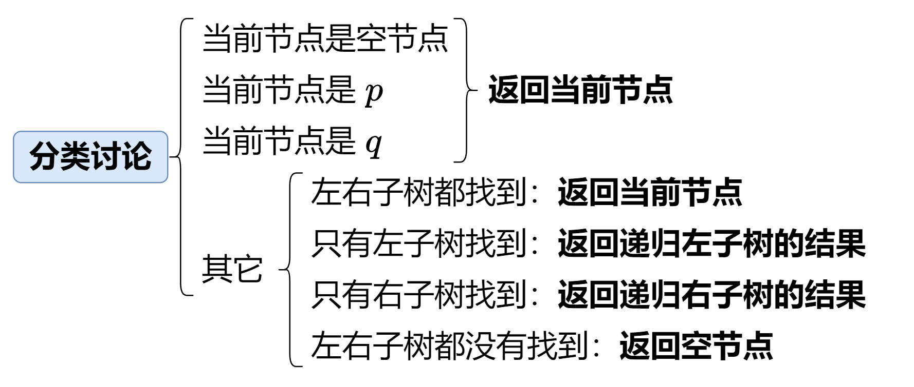
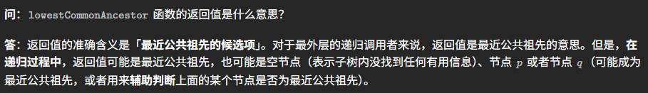
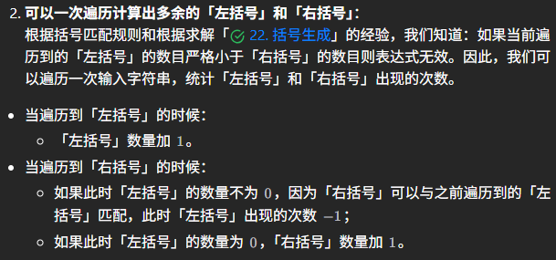

为灵神的基础算法精讲栏目专门整理一份刷题笔记。

在开始我想星标几个题，要么不好想，非常依赖刷题量；要么就是十分经典有价值。

专题12的235、236题。

## 1 相向双指针

### 1.1 LeetCode 167 两数之和 II - 输入有序数组

这是一道非常经典的相向双指针题，20250707首刷。数组原本已经升序，我们设置两个指针，一开始分别指向数组的两端，思路是，如果两数之和小于目标值，则左指针右移；如果两数之和大于目标值，则右指针左移；如果两数之和等于目标值，则返回两个指针的位置。

**我们知道，从力扣第1题“两数之和”中，我们可以学会使用哈希表来降低时间复杂度的思想。而接下来要讲的三数之和（15）、变形三数之和（16）、四数之和（18）、有效三角形的个数（611），都是在这题（167题）的思路基础上，采用相向双指针进行的。**

### 1.2 LeetCode 15 三数之和

这道题20240517首刷，20240914二刷，20250708三刷。首刷觉得它太微妙了，二刷感觉还是很神奇，三刷时结合之前的167题，终于理解了它的精妙之处。本质上，我们只要先把`nums`排序后，枚举`nums[i]`，然后使得`nums[j] + nums[k] = -nums[i]`，就可以了，这其实就是167题，因此也是采用同样的相向双指针思路。

### 1.3 LeetCode 16 最接近的三数之和

这道题20250708首刷，不用说了，思路几乎照抄15题。

### 1.4 LeetCode 611 有效三角形的个数

这道题20250709首刷，和前面的三数之和、四数之和略微有点变化。首先还是要把数组排序，接着我们按照“枚举最长边”的思路来解决这道题，什么时候相向双指针应该移动呢？当`nums[i] + nums[j] > nums[k]`时，说明针对`nums[j]`而言，左边的`i`随便怎么改变，只要它大于当前的`i`而小于`j`，这个范围内的`i`一定全都符合条件，一共有`j - i`种，把这些全部加上后，`j`应该左移；当`nums[i] + nums[j] <= nums[k]`时，说明`nums[i]`太小了，无论`j`怎么变，都不会有`nums[i] + nums[j] > nums[k]`，这个时候`i`应该右移。

这题新颖了，主要在于它的枚举方式和判断相向双指针什么时候移动，但本质上和前面几题还是一样的。

## 5 二分查找 数组峰值 旋转排序数组

### 5.1 LeetCode 162 寻找峰值

这道题20250725首刷，自己写了一个比较复杂的算法但是时间超过了100%的对手。实际上，二分问题的难点始终在于`check`函数的设计，灵神的思路可以大大简化`check`函数。


### 5.2 LeetCode 1901 寻找峰值II

这道题目有难度，是162的举一反三，20250726首刷。个人觉得先得有灵神的思路，简直太巧妙了。附一张灵神的题解图和示例代码，题解图和代码一起看，更可以搞懂。


```javascript
function indexOfMax(a) {
    let idx = 0;
    for (let i = 0; i < a.length; i++) {
        if (a[i] > a[idx]) {
            idx = i;
        }
    }
    return idx;
}

function findPeakGrid(mat) {
    let left = 0, right = mat.length - 2;
    while (left <= right) {
        const i = Math.floor((left + right) / 2);
        const j = indexOfMax(mat[i]);
        if (mat[i][j] > mat[i + 1][j]) {
            right = i - 1; // 峰顶行号 <= i
        } else {
            left = i + 1; // 峰顶行号 > i
        }
    }
    return [left, indexOfMax(mat[left])];
}
```

### 5.3 LeetCode 154 寻找旋转排序数组中的最小值 II

这道题20250728首刷，有难度。先来看灵神的思路：


再来看实现细节（采用闭区间做法）：

```java
class Solution {
    public int findMin(int[] nums) {
        int left = 0, right = nums.length - 2; // 闭区间 [0, n-2]
        while (left <= right) { // 闭区间不为空
            int mid = (left + right) >>> 1;
            if (nums[mid] < nums[right + 1]) right = mid - 1; // 蓝色
            else if (nums[mid] > nums[right + 1]) left = mid + 1; // 红色
            else right--; // 这样做的理由见题解
        }
        return nums[left];
    }
}
```

我始终不能理解的是，为什么需要使用这个技巧，让闭区间是`[0, n-2]`而不是`[0, n-1]`，它可以避免右边界越界，但是什么时候要采用这种写法呢？我就又不明白了。而这种做法之所以是正确的，如何理解呢？这些问题先提出来，都有待于后续理解。

## 7 链表热门题目2 环形链表II 重排链表

### 7.1 LeetCode 143 重排链表

这道题20250730首刷，其实就是第876题“链表的中间结点”+第206题“反转链表”的组合。我觉得这两个题都十分经典，第876题采用**快慢指针**的方式，这个一说出来我想就应该明白怎么做了；而第206题采用前插法的方式，其实就是下面几句话，我目前能理解，但感觉自己写不出来如此精练的代码，所以不如背背熟：

```javascript
// 206. 反转链表
let reverseList = function (head) {
    let prev = null;
    let curr = head;
    while (curr) {
        let nxt = curr.next;
        curr.next = prev;
        prev = curr;
        curr = nxt;
    }
    return prev;
};
```

## 11 验证二叉搜索树 前序/中序/后序

### 11.1 LeetCode 530 二叉搜索树的最小绝对差

这道题20250809首刷，就一点，一棵BST树，对其进行中序遍历，得到的结果就是从小到大有序的。

### 11.2 LeetCode 2476 二叉搜索树最近节点查询

这道题20250812首刷，就一点，一棵BST树不一定是AVL树，所以最坏情况下拿它查找，可以达到$O(n)$的时间复杂度。如果需要经常查找，可以中序遍历转成有序数组，再利用二分查找做到$O(n\log n)$的复杂度。

### 11.3 LeetCode 106 从中序与后序遍历序列构造二叉树

这道题20250815首刷，本身没什么难度，在这里提两个优化地方，可以把$O(n^2)$的复杂度优化至$O(n)$。一点是，先建立一张数字与数字索引对应的哈希表，这样只需要一次遍历，后面查找元素下标只需要$O(1)$的时间。另外一点，我们在递归调用时，不要传新数组，而是传递数组下标，这样子就可以避免反复构造数组。

但是实际上，灵神在这道题的最后也提出：**注：由于哈希表常数比数组大，实际运行效率可能不如写法一**。事实上，当数据量很小时，有时顺序遍历数组进行查找，会比用哈希表来的更快。因为数组在内存中是连续存储的，并且每次操作需要的开销也很小，哈希表尽管在理论上来得更优，但是在数据量小时，计算哈希值、处理冲突时未必比直接在数组中查找来的更快，因此无法从渐进时间复杂度中体现出来。

### 11.4 LeetCode 889 根据前序和后序遍历构造二叉树

这道题20250823首刷，整体的思想和106题类似，两个优化点也类似106，可以多练练不要去复制数组。

### 11.5 LeetCode 1373 二叉搜索子树的最大键值和

这道题20250826首刷。重要是能想到一次递归能同时返回三个值。我曾经想到用中序遍历形成数组，然后看数组区间里是否连续递增这个思路，但这道题行不通（不过这个思路也是很重要的一种思路，很多时候递归行不通时，得往这个方面想想）。


注意，如果是`null`节点，我们返回的`min`值应该是`+∞`，`max`值应该是`-∞`，这样子在父节点进行比较时才不会出错。至于为什么是这样的，需要思考明白，思考明白了这题就搞懂了，值得二刷。

## 12 二叉树的最近公共祖先

这是一类题。这一类题的递归和普通树的递归有点不同，我觉得这一类题尤其的搞脑子。首刷的时候只解决了两个题，还有两个题，感觉已经到达思维上线，无法解决。

这一类题要多练练，多思考。

### 12.1 LeetCode 236 二叉树的最近公共祖先

这个题20240809首刷，20250830二刷，还是难想。灵神用的分类讨论思想，我觉得并不好想，先给出思路和代码：



```javascript
var lowestCommonAncestor = function(root, p, q) {
    if (root === null || root === p || root === q) {
        return root; // 找到 p 或 q 就不往下递归了，原因见上面答疑
    }
    const left = lowestCommonAncestor(root.left, p, q);
    const right = lowestCommonAncestor(root.right, p, q);
    if (left && right) { // 左右都找到
        return root; // 当前节点是最近公共祖先
    }
    // 如果只有左子树找到，就返回左子树的返回值
    // 如果只有右子树找到，就返回右子树的返回值
    // 如果左右子树都没有找到，就返回 null（注意此时 right = null）
    return left ?? right;
};
```

接下来我们来解释，我们顺着图片中的思路来考虑。我们始终用`lowestCommonAncestor`函数来实现递归，如果当前节点是空节点，那么直接返回当前节点。**如果当前节点是`p`或者`q`，那还要递归吗？答案应该是不需要的。请注意，如果我们在递归的过程中发现了`p`或者`q`，直接返回这个节点就可以。因为如果`q`在`p`（或者`p`在`q`）的子树里面，那么`p`（或`q`）一定就是它们俩的最近公共祖先了；如果，它们俩不在一棵树中，那么`p`下面也不会有`q`，`q`只可能在另外一棵树那里，所以更不用往下递归了。想明白这一点十分重要**。

讨论完了上面这个部分，那么对其他情况进行讨论。如果左右子树都有返回值，说明`p`和`q`分别在当前节点的左右子树中，那么当前节点就是它们的最近公共祖先，直接返回当前节点即可。如果只有左子树有返回值，说明`p`和`q`都在左子树中，那么直接返回左子树的返回值即可；如果只有右子树有返回值，说明`p`和`q`都在右子树中，那么直接返回右子树的返回值即可；如果左右子树都没有返回值，说明`p`和`q`都不在当前节点的子树中，那么直接返回`null`即可。

直接用`lowestCommonAncestor`函数来实现递归，这点非常不好想。大家想想，这个函数到底返回了个什么东西呢？实际上，它返回值的含义严格来说应该是**最近公共祖先的候选项**。



### 12.2 LeetCode 235 二叉搜索树的最近公共祖先

这道题是236题的降级版，20250829首刷，在这里不整理解法，请基于236题自己想出来，值得二刷。

## 13 二叉树的层序遍历 广度优先搜索

层序遍历这一类题，一种典型解法就是使用广度优先搜索（BFS）来实现。我们在实现的过程中，把每一层节点利用一个队列来进行存储，然后逐一取出。具体实现方式为：用一个变量存储某一层节点的个数，然后每次从队列中取出这个个数的节点，并依次把它们的子节点放入队列中，直到队列为空。这样子就可以实现层序遍历。

## 15 回溯算法套路② 组合型回溯+剪枝

### 15.1 LeetCode 301 删除无效的括号

这道题20250920首刷，看着官方题解敲了一遍，但是仍旧不太会做。有关键步骤没理解，不过这道题可以先学到一点：



期待未来二刷。