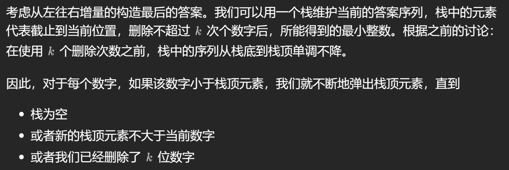

这是我的算法刷题小指南。和大多数人一样，我并不对算法有着十分高超的水准，只是一个热爱计算机，并且愿意练习的普通人。我会在这里记录我刷题的一些心得和一些题目的解法。希望能够帮助到一些人。

本文的内容部分参考了[字节跳动程序媛教你如何刷算法题：面试手撕代码我就没怕过](https://blog.csdn.net/qq_29966203/article/details/122890389)等多篇文章。在此感谢他们的贡献。

# 写在最前
刷题，要有策略，讲究方法和效率。

**按照面试考察频率的排列，按照以下顺序刷题：**

**哈希表与字符串 > 链表 > 二叉树与图 > 二分查找与二叉排序树 > 栈、队列、堆 > 其他（主要是一些数学问题）> 递归、回溯与分治 & 贪心算法 > 搜索 > 复杂数据结构 > 动态规划**

首先刷题一定是有针对性地刷，看完题目后请各位先来一个灵魂三问：
1.  这道题属于哪类题型？
2.	这类题型的解法是什么？
3.	有没有模板可以套？

对于刷完了的题目，要善于总结，针对每个类型的题目归纳出一套通用的方法。对每个题目模式化，并且对于每一类题型总结出一套伪代码。

首先看下这个思路与伪代码的契合度。如果无法直接套用，有2个原因。1是伪代码不够通用，2是着实属于一道新题型；

如果是1，需要根据总结出的思路进一步完善自己的伪代码；
如果是2的话，可以作为这一类题型的一个衍生题型，单独去记忆。这里的记忆不是去背题，而是去总结另一套模版。

可能有的人会好奇伪代码怎么写，我这里教大家一个通用的方法：既然不好抽象解法，我们抽象题目。将题目去简化为一个知识点，然后针对这个知识点写算法。

**套用上面的办法，我在题海中循序渐进。**

备注：到目前，第297（449）题、仍未通过，但算法貌似没问题。

## 相关概念解释：

**原地算法**：在计算机科学中，一个原地算法（in-place algorithm）基本上不需要额外辅助的数据结构,然而,允许少量额外的辅助变量来转换数据的算法。

# 0. C++要点

## 0.1 指针
①指针声明时，如果不规定初值，那么一定要赋NULL值防止出错。

## 0.2 字符串
①字符串的比较，可以直接用==，但是字符串的赋值不能直接用=，需要用`strcpy()`函数。

②字符串转整数，可以使用`stoi()`函数。转浮点数用`stof()`函数。转双精度用`stod()`函数。

③数字转字符串，可以使用`to_string()`函数。

### 字符串的访问方式

`string`类是C++语言引入的新的类，用于处理字符串。下面是如何使用下标运算符来访问 `std::string` 类中的字符：

``` cpp
std::string str = "Hello, World!";
char front_char = str[0];  // 获取字符串的第一个字符，结果是 'H'
char back_char = str.back();  // 获取字符串的最后一个字符，结果是 '!'
char middle_char = str[5];  // 获取字符串中索引为5的字符，结果是 ' '
```
使用 operator[] 访问字符串中的字符时，**C++ 标准不要求进行边界检查**。这意味着如果访问的索引超出了字符串的当前长度，将不会抛出异常，但行为是未定义的（undefined behavior）。因此，访问之前应确保索引是有效的。

此外，下标运算符operator[] 也可以用来修改字符串中的字符，但请确保你访问的是有效的索引。

``` cpp
str[0] = 'h';  // 将字符串的第一个字符从 'H' 修改为小写的 'h'
```

### 将`vector<char>`转换为`string`

``` cpp
std::vector<char> vec = {'H', 'e', 'l', 'l', 'o'};
std::string str(vec.begin(), vec.end());
```


## 0.3 时间复杂度
参考 https://blog.csdn.net/qq_41306849/article/details/117664292

一般而言，ACM或者力扣时间限制为1秒或者2秒。在这种情况下，C++代码中的操作次数控制在 1e7 为最佳。

**一旦n到达1e4，就不适合n2的暴力解法，达到1e6就要开始考虑n的解法，达到1e7就要往更小的去考虑。基本上1e7往上没有暴力法可行。**

## 0.4 常用的容器与库函数

注意，库函数作用在容器上时，往往需要使用迭代器。

`__gcd(a, b)`函数：求a和b的最大公约数。

`swap(a, b)`函数：交换两个变量的值。

`reverse(it, it2)`函数：反转容器中的元素。

`sort(it, it2)`函数：对容器中的元素进行排序。时间复杂度：`O(nlog(n))`。 注意，`sort`函数的默认排序是升序，如果要降序，需要自定义比较函数。关于自定义比较函数，参见下面的例子：

```cpp
bool cmp(int a, int b) {
    return a > b;
}

int main(){
    sort(vec.begin(), vec.end(), cmp);
}
```

**对于容器`vector`，我们可以使用`erase`来删除某一段容器中的数据，操作方法如下：这个操作是`O(n)的`**
``` cpp
vector<int> vec = {1, 2, 3, 4, 5};
vec.erase(vec.begin() + 1, vec.begin() + 3);  // 删除vec中索引为2和3的元素
// 除此之外，erase(it)即删除迭代器为it处的元素
```

## 0.5 C++ `set`

下面是一个简单的`set`示例。注意：**C++除了`vector`、`string`、`deque`外，其余的容器大多都不可以使用`[]`来进行访问，只能通过迭代器进行访问。只需要记住前面提到的三种容器支持随机访问即可。**

**此外，映射`map`可以通过键值进行随机访问。**

``` cpp
#include <iostream>
#include <set>

int main() {
    std::set<int> mySet;

    // 向set中插入元素
    mySet.insert(10);
    mySet.insert(20);
    mySet.insert(5);
    mySet.insert(10); // 重复的元素，不会插入

    // 打印set中的元素
    for (int num : mySet) {
        std::cout << num << " ";
    }
    std::cout << std::endl;

    // 查找元素
    auto it = mySet.find(15);
    if (it != mySet.end()) {
        std::cout << "找到了元素: " << *it << std::endl;
    } else {
        std::cout << "没有找到元素" << std::endl;
    }

    // 移除元素
    mySet.erase(10);
    std::cout << "移除元素后的set: ";
    for (int num : mySet) {
        std::cout << num << " ";
    }
    std::cout << std::endl;

    return 0;
}
```

## 0.6 动态内存分配

请看下面的例子：
```cpp
int n = 5;
int **dp = new int*[n];
for(int i = 0; i < n; ++i) {
    dp[i] = new int[n]();
}

for(int i = 0; i < n; ++i) {
    delete[] dp[i]; // 释放每一行的内存
}
delete[] dp; // 释放指针数组的内存
```

## 0.7 Vector的几个常见方法用法

### 构造方法

```cpp
vector<int> pre(n, 1);
```

这行代码是声明了一个 `pre` vector容器，并且初始化所有容器内元素为1。

### resize()

该方法用于调整vector大小，如果新大小大于当前大小，新增加的元素将被初始化为默认值。如果新大小小于当前大小，vector将被截断，超出新大小的元素将被丢弃。

resize()和构造方法一样，也可以有两个参数，第一个参数代表新vector大小，第二个参数就代表默认值，例如：

```cpp
vector<int> v = {1, 2, 3, 4, 5};
v.resize(7, 0);
```

在这个例子中，vector v的大小被改变为7，新增加的元素被初始化为0。

# 0. JavaScript 要点

## 0.1 `let` `var` 与 `const`

详见：https://www.runoob.com/js/js-let-const.html

在JavaScript中，`let`、`var` 和 `const` 是用来声明变量的关键字。它们在作用域和提升（hoisting）方面有一些不同。以下是它们的主要区别：

### 1. 作用域（Scope）
- **`var`**：拥有函数作用域或全局作用域。如果在一个函数内部声明，那么它只能在该函数内部访问。如果在函数外部声明，那么它是一个全局变量，可以在任何地方访问。
- **`let`** 和 **`const`**：拥有块级作用域。这意味着它们只能在声明它们的代码块（例如，一个`if`语句或`for`循环）内部访问。

### 2. 变量提升（Hoisting）
- **`var`**：会被提升到其所在作用域的顶部，但只有声明被提升，赋值不会提升。
- **`let`** 和 **`const`**：不会像`var`那样被提升，它们会经历一个称为“暂存死区”（Temporal Dead Zone, TDZ）的阶段。在变量声明之前访问它们会抛出一个`ReferenceError`。

### 3. 可变性（Mutability）
- **`var`** 和 **`let`**：允许重新赋值。
- **`const`**：不允许重新赋值。一旦声明并赋值，其值就不能被改变。需要注意的是，如果`const`声明的是一个对象或数组，那么对象或数组的属性可以被修改，但变量指向的对象本身不能被重新赋值。

### 4. 初始值
- **`var`**：可以不立即初始化，稍后赋值。
- **`let`** 和 **`const`**：必须在声明时立即初始化。

### 示例
```javascript
function example() {
    console.log(foo); // 输出: undefined
    var foo = 1;
    console.log(foo); // 输出: 1
}

function example2() {
    console.log(bar); // 抛出 ReferenceError: bar is not defined
    let bar = 2;
    console.log(bar); // 输出: 2
}

function example3() {
    const baz = 3;
    console.log(baz); // 输出: 3
    baz = 4; // 抛出 TypeError: Assignment to constant variable.
}

function example4() {
    const obj = { value: 1 };
    console.log(obj.value); // 输出: 1

    obj.value = 2; // 允许修改对象属性，这里要特别注意！！！
    console.log(obj.value); // 输出: 2

    const obj = { value: 2 }; // 抛出 TypeError: Assignment to constant variable.
}
```

### 总结
- 使用`var`时，需要注意变量提升和作用域问题。
- 使用`let`可以避免变量提升和作用域问题，适用于需要重新赋值的变量。
- 使用`const`可以保证变量的值不变，适用于不需要重新赋值的变量，有助于减少错误和提高代码的可读性。

**在现代JavaScript开发中，推荐尽可能使用`let`和`const`，因为它们提供了更严格的作用域控制和更清晰的代码结构。**

## 0.2 类

在JavaScript中，使用`function`关键字来定义一个类是一种语法糖，它允许我们以一种更传统的方式来定义对象的结构和行为。这种语法实际上是基于JavaScript的原型链机制的。下面是使用`function`关键字定义类的两种主要方式：

1. **构造函数**：在JavaScript中，`function`关键字可以用来定义一个构造函数，这个构造函数可以用来创建具有相同属性和方法的对象实例。当你使用`new`关键字来调用这个函数时，它就相当于一个类。

   ```javascript
   function Person(name, age) {
       this.name = name;
       this.age = age;
   }

   Person.prototype.greet = function() {
       console.log(`Hello, my name is ${this.name} and I am ${this.age} years old.`);
   };

   const person1 = new Person('Alice', 30);
   person1.greet(); // 输出: Hello, my name is Alice and I am 30 years old.
   ```

2. **ES6类定义**：在ES6（ECMAScript 2015）中，`class`关键字被引入，提供了一种更清晰的方式来定义类。然而，`class`实际上是一种语法糖，它背后的实现仍然是基于`function`的。

   ```javascript
   class Person {
       constructor(name, age) {
           this.name = name;
           this.age = age;
       }

       greet() {
           console.log(`Hello, my name is ${this.name} and I am ${this.age} years old.`);
       }
   }

   const person2 = new Person('Bob', 25);
   person2.greet(); // 输出: Hello, my name is Bob and I am 25 years old.
   ```

在ES6类定义中，`constructor`方法是一个特殊的方法，用于创建和初始化类的对象。它的作用类似于使用`function`关键字定义的构造函数。

使用`function`来修饰类的原因包括：

- **原型链**：JavaScript是基于原型的，每个对象都有一个原型对象，对象的属性和方法实际上是通过原型链来继承的。
- **语法糖**：`class`关键字提供了一种更简洁和易于理解的方式来定义类，但它实际上是对原型链和构造函数语法的封装。
- **兼容性**：在ES6之前，JavaScript没有内置的`class`语法，因此使用`function`来定义类是一种常见的做法，这也保证了代码的向后兼容性。

总的来说，`function`关键字在JavaScript中扮演了多重角色，包括定义函数、构造函数和类。这使得JavaScript在面向对象编程方面具有很高的灵活性。

## 0.3 JavaScript `Map`

## 0.4 JavaScript 字符串

`length()` 获取字符串长度，`toUpperCase()` 把一个字符串全部变为大写，`toLowerCase()` 变为小写。

`indexOf()` 搜索指定字符串出现的位置，找到返回下标开始值，没找到返回-1。

`substring()` 返回指定索引区间的字串。但我也比较喜欢用`slice()`这个函数，参见下面的例子：

```javascript
s = 'woshiniba';
s.slice(0, 2);    // 'wo'
```

它表示从0起始到（2-1）位置处结束。因此`slice(i,j)`代表从i开始j-1处结束。

## 0.5 JavaScript 多维数组

直接看例子：

```javascript
// 生成dp[i][i]，并用false填充。
let dp = new Array(n);
for (let i = 0; i < n; i++) {
    dp[i] = new Array(n).fill(false);    // fill就是填充
}
```

## 0.6 除法

注意：**JS使用"/"时不会默认向下取整。需要使用Math.floor()方法对括号内的值进行向下取整。**

# 1. 哈希表与字符串、数组、双指针、滑动窗口、前缀和

## 1.1 滑动窗口

**本节基于LeetCode 3。**

关于滑动窗口，思路很简单。就是维护一个窗口，窗口的左右边界分别是left和right。然后，right向右移动，直到找到一个满足条件的窗口。然后，left向右移动，直到找到一个不满足条件的窗口。然后，再次重复上述过程。**要注意，left需要移动到第一个不满足题目要求的地方。**

这里有一个小技巧。就是维护一个哈希表，用来记录窗口中的元素。这样子，我们就可以在O(1)的时间复杂度内判断窗口中是否满足条件。

## 1.2 哈希表散列函数的构造与冲突处理方法

**本节参照ZJU的MOOC**。设计哈希表散列函数的构造中，要尽量避免冲突。下面讲两个点，一个是散列函数的构造，另一个是冲突的解决。

### 1.2.1 散列函数的构造

下面继续分成两类。一类是整数散列函数，另一类是字符串散列函数。

整数散列函数主要有**直接定址、除留余数、平方取中**等方法。

字符串散列函数的处理方法有，ACII码相加法、**移位法**等等。把每个字符看成是32进制的一个数，计算出该字符串的数值，最后对每个计算结果除以哈希表大小算出最终应该把该字符串放在哈希表的哪个位置。

### 1.2.2 冲突的解决

解决的办法很简单，我们一般使用**拉链法**。就是在哈希表的每个位置上，都维护一个链表。这样子，当冲突发生时，我们就把新的元素插入到链表的头部。随后要查找，只需要遍历这个链表。

**拉链法的优点是容易实现和理解，适用于处理哈希冲突，并且相对节省内存。然而，当哈希冲突较为频繁时，链表可能会变得很长，导致查找效率下降。为了避免这种情况，可以考虑在链表长度达到一定阈值时，将链表升级为更高效的数据结构，比如红黑树。**

## 1.3 LeetCode 128 最长连续序列

这个题需要掌握一个STL容器`unordered_set`。`unordered_set`是一个无序的集合，底层实现是哈希表。这个容器的插入、删除、查找操作的时间复杂度都是O(1)。

**在思维上，遍历nums数组，假设某个连续串的开始值为$x$，那么我只需要检查$x - 1$是否在原先的数组中，如果在，那这个值我就不需要检查；如果不在，那么这个值就一定是某个序列的开始值，我需要检查。**


## 1.4 LeetCode 283 移动零 双指针

典型的双指针例题。维护两个指针，左指针左边全是非0数，右指针左边到左指针为止全是0。右指针向右移动，遇到非0数，就和左指针交换。这样子，左指针左边全是非0数，右指针左边全是0。

## 1.5 LeetCode 11 盛最多水的容器 双指针

这个题其实还是个**贪心**问题。我们设置一左一右指针分别位于数组起点和数组终点，贪心策略是，每次都移动较短的那根柱子。证明其实很简单，因为如果保留较短的那根柱子，另外一边的柱子无论比原来长，还是比原来短，加上两者距离变短，那么它都会比原来的面积小。所以，我们每次都移动较短的那根柱子，直到两根柱子相遇。

## 1.6 LeetCode 15 三数之和 双指针

这个题解法见灵神视频，十分巧妙。如何避免遇到重复的解，我们只需要在遍历`nums`数组的时候，如果遇到重复的元素，我们就跳过这个元素。此外，对于指针p和q也是采用相同的办法，遇到重复元素直接略去。

## 1.7 LeetCode 303 前缀和模板题 区域和检索-数组不可变

本题思路见灵神题解。在这里我们引出**前缀和**的概念：

对于一个数组a[n]，我们可以构造一个前缀和数组s[n]，其中s[i]表示数组a[0]到a[i]的和。这样子，我们就可以在O(1)的时间复杂度内求出数组a[i]到a[j]的和，即s[j] - s[i - 1]。

**但在实际操作中，我们一般把s[0]默认设置成为0，从s[1]开始记录前缀和，最终生成了大小为`s[n+1]`的前缀和数组。**

**前缀和的主要目的，在于我能用`O(1)`的时间复杂度，求出任何数组a[i]到a[j]的和。**

LeetCode 560采用前缀和和哈希表可以把时间复杂度降到O(n)。但到目前为止，我一直没搞懂。

## 1.8 LeetCode 238 除自身以外数组的乘积 前缀和

这道题也是一道典型的前缀和问题，题目要求不用除法实现，这就引入了左右两端的前缀和。`front`数组用于存储从前向后的前缀和，`back`数组用于存储从后向前的前缀和。这样，我就很容易算出ans，只需要把左右两个前缀和相乘，不包含中间就行。

# 2. 链表

## 2.0 概述

链表的题大多与指针相关，这里需要记住，**在设置指针时一定要首先置空，避免出现野指针的情况。**

此外，在进行链表节点的更改时，同时也需要记得一次性修改好多节点，思维一定要清楚，需要及时进行验证（参考LeetCode 24的教训，想当然但是实际情况不是这样）。

## 2.1 链表倒序

**本节基于LeetCode 92、206。**

针对链表倒序，使用迭代法。从头结点开始遍历，设置两个指针，curr和prev。curr指向当前节点，prev指向当前节点的前一个节点。每次迭代，将curr的next指向prev，然后prev和curr都向后移动一位。直到curr为空，prev就是新的头结点。同时，需要暂存curr的next节点，以免丢失。

还请记住一个性质。当遍历完链表，curr会指向null。而prev会指向最后一个节点。所以，prev就是新的头结点。

## 2.2 链表求交点 (Leetcode 161)

一般解法不难，这里如果想要使用时间复杂度为O(m+n)，空间复杂度为O(1)的办法，可以使用双指针法。两个指针分别指向两个链表的头结点，然后同时向后移动。当一个指针到达尾部时，将其指向另一个链表的头结点。这样，两个指针走过的路程是一样的。

这样子，如果他们真的有公共交点，假设链表a长度是m，链表b长度是n，公共部分长度为p，那么a指针走过的路程是m+(n-p)，b指针走过的路程是n+(m-p)，两个部分长度一样。所以，他们会在公共交点相遇。如果没有公共交点，他们会在null处相遇。

## 2.3 链表合并（LeetCode 23 21）

这两道题的启示是，在建立新链表的时候，需要创建一个**哨兵**节点，这个节点指向新链表的头结点。这样子，我们就可以在不知道新链表头结点的情况下，方便地返回新链表。

同时，链表的题目需要反复用到curr、prev等指针，循环条件往往是这些指针非空，在内存改接的时候需要经常注意是否访问到了不合法的内存，以免报错。

## 2.4 前后指针（LeetCode 19）

## 2.5 双向链表+哈希表 LeetCode 146 LRU缓存

这个题非常好。难度大，要在短时间内解出就必须多练。它同时是vue keep-alive组件中的核心算法。2024.7.31首刷。

# 3 树

写下这章时，本人已经好久没碰树了。树的题目一般都是通过递归，有的时候还会需要用到栈。必须掌握三种遍历方法。主要都是模板题。但下面的这些题还是很有意思的。

## 3.1 LeetCode 543 二叉树的直径

直接写思路：从上往下遍历。当前结点的直径 = 左子树链长 + 右子树链长 + 2，当前节点链长 = max(左子树链长，右子树链长) + 1。

# 4 图

## 4.1 Vector存图

在C++语言中，图可以使用Vector进行存储。例如：

```cpp
vector<vector<int>> edges;
```

这实际上是一个邻接表，这样子，```edges[i]```就是一个```vector```，存储了```i```节点的所有邻接节点。

在Leetcode 207中，还用到了对于```vector```的```resize()```函数。通过该函数可以初始化（重置）邻接点的个数，方便图的建立。

## 4.2 LeetCode 207 课程表拓扑排序

# 5 二分查找 && 二叉查找树

## 5.1 二分查找

二分查找有模板和变式，此处以模板为例。模板如下：

这个模板是我高中时候学会的模板。什么都不用变。不用加一也不用减一。

```cpp
int binarySearch(vector<int>& nums, int target) {
    int left = 0, right = nums.size() - 1;
    while (left <= right) {
        int mid = (left + right) / 2;   // 中间值
        if (nums[mid] == target) return mid;
        else if (nums[mid] < target) left = mid + 1;    // 中间值+1
        else right = mid - 1;   // 中间值-1
    }
    return -1;
}
```

**至于变式，主要喜欢在left right还有mid上面做文章，喜欢+1-1，或者考你错误的二分解法，为什么不可以此类。**

### 5.1.1 LeetCode 108

这个题可以直接使用二分查找的思想。mid作为根节点，然后左右分别递归建立树即可。感觉得把这题背下来。没遇到过可能想不出来。

## 5.2 Leetcode 33 无序数组（旋转数组）二分查找

这道题是针对无序数组的二分查找。但实际上，二分查找的关键并不在于数组是否有序，**而是能否判断接下来的查找范围应该在数组的哪一边**。有序数组只是让这一步变得简单。

对于此题来说，也可以使用单次二分查找来解决。解题思路：按照二分模板算出mid，mid的左右两侧一定至少有一侧是有序的，如果target在有序的一侧，那么就在有序的一侧继续二分查找，否则在无序的一侧继续二分查找。

为什么可以这样做呢？**因为有序的一侧，我们可以直接判断target是否在这一侧，而无序的一侧，我们无法判断target是否在这一侧。** 所以，我们可以通过判断target是否在有序的一侧，来决定继续在哪一侧查找。

## 5.3 二叉查找树的恢复（Leetcode 449）

一个风和日丽的下午，还记得自己在学习数据结构的时候，听到ZJU何钦铭老师讲到如何恢复一棵二叉树。

**给定一棵二叉树，只要给出①先序遍历和中序遍历，或者②中序遍历和后续遍历，那么就一定能够恢复这棵二叉树。**

https://www.icourse163.org/learn/ZJU-93001?tid=1468825451#/learn/content?type=detail&id=1251326039&cid=1280334953

下面对①进行具体例子的分析：**先序遍历时，print的结果是根左右，中序遍历时，给的结果是左根右。** 那么，对于先序遍历和中序遍历，我们可以通过先序遍历找到根节点，然后在中序遍历中找到根节点的位置，这样子就可以确定左右子树的范围。然后，递归地构建左右子树。

**但是，这道题不能简单的用两种序列遍历方法恢复。此题的思路类似于LeetCode 297。**

## 5.4 Leetcode 315 树状数组

此题的另一种解法是归并排序。见**LCR 170**。

## 5.5 LeetCode 236 二叉树的最近公共祖先

这个题，递归+分类讨论，没有任何套路，直接贴解法。**非常好的典型题。用于深刻理解递归。**


```javascript
var lowestCommonAncestor = function(root, p, q) {
    if (root === null || root === p || root === q) {
        return root;
    }
    const left = lowestCommonAncestor(root.left, p, q);
    const right = lowestCommonAncestor(root.right, p, q);
    if (left && right) {
        return root;
    }
    return left ?? right;
};
```


## 平衡二叉树（AVL树）

关于AVL树，一颗树是平衡的话，我们需要能够手撕RR、LL、RL、LR四种旋转方式。

写代码的方式很简单。把每种情况模型抽象出来就行。

# 6 栈、队列、堆

## 6.1 Leetcode 224 计算器——栈的灵活运用

这道题肯定要用到栈。一个解法是，使用三参数。具体如下：

```cpp
int presign = 1;    // 初始时符号为1，表示正数
long long num = 0;    // 记录当前的数值
long long ans = 0;    // 存储答案
```

其中，`presign`表示当前的符号，`num`表示当前的数值，`ans`表示答案。下面详细介绍这三个参数的具体用法：

1. 初始时，`presign`需要设置成1，接下来每当读入＋时，`presign`设置成1，读入-时，`presign`设置成-1。这样子，`presign`就可以表示当前的符号。

2. 一个指针可以指到数字，那么每当读取一个数字，我就`num * 10 + s[k]`，其中`s[k]`代表当前读入的值。这是一种常用做法，`num`也就因此暂存遇到的数字。

3. 当遇到`+`或者`-`时，我们需要根据`presign`和`num`来更新`ans`。`ans += presign * num`。这样子，`ans`就可以存储当前的答案。

4. **当遇到左括号时，我们要将此时的`ans`和`presign`通通压入栈中，然后把`presign`复位，`num`和`ans`统统归0，相当于新开了一个函数，能够从0开始计算括号内的值。**

5. **当遇到右括号时，我们需要计算出来括号内的值了。算完之后，括号内的值整体应该当作一个数，重新传回暂存当前数的`num`之中，然后将`presign`和`ans`统统弹出来。**

如此反复循环，就完成了这道题的解。

## 6.2 Leetcode 215 数组中第K大的元素——堆的灵活运用

**注意：堆排很常见也很重要，务必掌握。** 本题采用建立大顶堆的方法。

## 6.3 Leetcode 295 数据流中的中位数

本题的核心思想也是用堆。这是一道Leetcode困难题，需要将时间复杂度降至`O(logn)`。注意以下两点结论：

1. 一个无序数组，建立堆的时间是`O(n)`，
2. **一个堆插入一个元素的时间是`O(logn)`，插入的方法是始终插入这棵完全二叉树最末尾的地方，然后反复调整。**
3. **一个堆删除一个元素的时间是`O(logn)`，始终删除堆顶，把堆的最末尾元素放到堆顶，然后反复调整。**

这里使用两个堆，一个大顶堆，一个小顶堆。大顶堆存储较小的一半，小顶堆存储较大的一半。这样子，中位数就可以通过两个堆的堆顶元素计算出来。下面是K神的代码：

```cpp
class MedianFinder {
public:
    priority_queue<int, vector<int>, greater<int>> A; // 小顶堆，保存较大的一半
    priority_queue<int, vector<int>, less<int>> B; // 大顶堆，保存较小的一半
    MedianFinder() { }
    void addNum(int num) {
        if (A.size() != B.size()) {
            A.push(num);
            B.push(A.top());
            A.pop();
        } else {
            B.push(num);
            A.push(B.top());
            B.pop();
        }
    }
    double findMedian() {
        return A.size() != B.size() ? A.top() : (A.top() + B.top()) / 2.0;
    }
};
```

**这段代码很巧妙。** 实际上，对于函数`addNum`，这里每次插入元素不用比较大小的原因在于，此时来了一个新的元素，我想插入A，他有两种情况，第一种他比B的堆顶元素大，此时理论上可以直接插入A；第二种情况，他比B的堆顶元素小，此时就不能直接插入A，需要先插入B维持较小的元素都在B内，然后取B的堆顶元素插入A； 而为了简化比较操作，回到第一种情况，可以先统一把元素插入B，然后此时B基于大顶堆的结构特性，会将该元素作为新的堆顶元素，此时再执行插入A的操作就相当于此前在B处过渡了一下，最终还是会插入A 可以理解是代码更简洁，但用堆的自身调整操作替换了比较大小的操作。

## 6.4 总结——堆

**通过 Leetcode 215 和 295，我们需要学会总结，一般而言，建立堆采用优先队列或者栈，虽然堆是一棵树，但是我们不能把它当成树来写。有的时候，数组也可以用来建堆。**

下面来说说采用优先队列建堆的情况：

## 6.5 单调队列 LeetCode 239 —— 滑动窗口最大值

这道题是一道经典的单调队列题。单调队列的特点是，队列中的元素是单调递增或者单调递减的。这样子，我们可以在O(1)的时间复杂度内找到队列中的最大值或者最小值。

**单调队列套路：**

1. 入（元素进入**队尾**，同时维护队列**单调性**）
2. 出（元素离开**队首**）
3. 记录/维护答案（根据**队首**）

在C++语言下，我们使用`deque`来实现单调队列。`deque`是一个双端队列，可以在队首和队尾进行插入和删除操作。**需要注意的是，`deque`也可以支持随机访问，它是除了`vector` `string`外又一个可以使用`[]`访问的容器。**

`deque`的操作方法也很简单，加上队首只是相比于`vector`多了`pop_front()`和`push_front()`方法。

# 7 递归、回溯和分治

**从这一章开始我们跳出对基本数据结构的理解，开始走向算法设计。**

## 7.1 子集型回溯问题

本节基于LeetCode 78、17。

LeetCode 78 是我入手这一类问题的门。

下图是考虑子集型回溯问题的思路：


这是个思路一。事实上，还有思路二，按照灵神的说法就是站在答案的角度想问题。这种思路二的方法我还不会，有待补充。**思路一近似于动态规划的思想**。

模板见下：

```cpp
// LeetCode 78
class Solution {
public:
    int n;  
    vector<vector<int>> ans;    // 全局变量存答案

    vector<vector<int>> subsets(vector<int>& nums) {
        vector<int> path;
        n = nums.size();
        dfs(nums, path, 0);
        return ans;
    }

    void dfs(vector<int>& nums, vector<int>& path, int i){
        if(i == n){
            ans.push_back(path);
            return;
        } 
        // 不选这个，直接dfs下一个
        dfs(nums, path, i + 1);
        // 选这个，需要将这个加入path中，再dfs，最后再弹出
        path.push_back(nums[i]);
        dfs(nums, path, i + 1);
        path.pop_back();
    }
};
```

## 7.2 对称二叉树 LeetCode 101

这个题没啥好讲的，从上往下比较，比较左边节点和右边节点值是否相同后，在比较左边节点左儿子和右边节点右儿子是否相同以及左边节点右儿子和右边节点左儿子是否相同。但这个题的算法实在是太巧妙了，很难想到。

## 7.3 LeetCode 105 前序中序遍历构造树

也是递归。但是这题不好写。**可以动手多练。**

# 8 贪心

**贪心，顾名思义，就是每一步都选择最优值。下面从几个例题中出发。**

## 8.1 LeetCode 376 摆动序列

**这个题略抽象。贪心的点在于，我们每一次都选择在`峰`或者在`谷`中的值。** 只需计算峰和谷的数量，我们就可以算出序列中存在多少个元素。

这个题贪心很复杂，我觉得不如动态规划。

## 8.2 LeetCode 402 移掉K位数字

**这个题目主要采用贪心+单调栈的思想。这个题目很经典，非常不错。**





# 9 技巧题

## 9.1 LeetCode 136 只出现一次的数字（位运算）

这个题使用位运算来实现。算法是，可以证明，我们只要把所有数字都亦或一遍（因为两个数相同亦或是0，一个数和0亦或是这个数本身），最后的结果就是只出现一次的数字。

## 9.2 LeetCode 189 轮转数组

这个题看起来也像技巧题。假设需要向右轮转$k$次，那么将数组向右轮转的办法是反转整个数组之后，先反转数组的前$k$位，后反转数组的后$n-k$位。

# 10 暴力与模拟

这部分类型的题，没有技巧可循，考验的就是纯代码能力。**注意，这种类型的题一定要想办法在紧张的环境下，限制自己的时间做题。** 这里推荐几个不错的题：

1. LeetCode 54 螺旋矩阵

2. LeetCode 240 搜索二维矩阵

太妙了，实在是太妙了。从右上角开始搜索。

# 11 排序

把排序题单独拎出来。这里主要是介绍归并排序与快速排序。

## 11.1 LeetCode 148 排序链表

这道题要求我们在链表上采用$O(nlog(n))$的时间复杂度来实现。显然我们得选择快速排序或者归并排序。这里我选择归并排序，参考K神的题解。**这种题一定要多动手实践**。

# 12 动态规划

## 12.1 LeetCode 5 最长回文子串 多维动态规划

针对这道题，我们定义`dp[i][j]`为“从i到j是否为回文子串”这一布尔类型。显然我们可以推导出这样的状态转移方程：dp[i][j] = dp[i + 1][j - 1] && (s[i] == s[j])。但显然这样子还不够。这些状态的初值如何确定呢？这里我们需要再添加一个判定条件：

```javascript
    if (j - i < 2) {
        if (s[i] === s[j]) dp[i][j] = true;    // 如果这个字符串只有两个字符比较这两个字符是否相同
    }
    else {
        dp[i][j] = dp[i + 1][j - 1] && (s[i] === s[j]);
    }
```

那如果只有一个字符呢？我们需要在开始时就将dp[i][i]类型的所有值都赋为true。

**而这个题最恶心的地方，就在于将状态转移方程应用的时候，需要一列一列从上往下遍历。至于这个结果怎么来的可以参看力扣官方题解。**