这是我的算法刷题小指南。和大多数人一样，我并不对算法有着十分高超的水准，只是一个热爱计算机，并且愿意练习的普通人。我会在这里记录我刷题的一些心得和一些题目的解法。希望能够帮助到一些人。

本文的内容部分参考了[字节跳动程序媛教你如何刷算法题：面试手撕代码我就没怕过](https://blog.csdn.net/qq_29966203/article/details/122890389)等多篇文章。在此感谢他们的贡献。

# 写在最前
刷题，要有策略，讲究方法和效率。

**按照面试考察频率的排列，按照以下顺序刷题：**

**哈希表与字符串 > 链表 > 二叉树与图 > 二分查找与二叉排序树 > 栈、队列、堆 > 其他（主要是一些数学问题）> 递归、回溯与分治 & 贪心算法 > 搜索 > 复杂数据结构 > 动态规划**

首先刷题一定是有针对性地刷，看完题目后请各位先来一个灵魂三问：
1.  这道题属于哪类题型？
2.	这类题型的解法是什么？
3.	有没有模板可以套？

对于刷完了的题目，要善于总结，针对每个类型的题目归纳出一套通用的方法。对每个题目模式化，并且对于每一类题型总结出一套伪代码。

首先看下这个思路与伪代码的契合度。如果无法直接套用，有2个原因。1是伪代码不够通用，2是着实属于一道新题型；

如果是1，需要根据总结出的思路进一步完善自己的伪代码；
如果是2的话，可以作为这一类题型的一个衍生题型，单独去记忆。这里的记忆不是去背题，而是去总结另一套模版。

可能有的人会好奇伪代码怎么写，我这里教大家一个通用的方法：既然不好抽象解法，我们抽象题目。将题目去简化为一个知识点，然后针对这个知识点写算法。

**套用上面的办法，我在题海中循序渐进。**

备注：到目前，第297（449）题、仍未通过，但算法貌似没问题。

**仓库中的代码为临时代码，不保证直接可以跑通。**

## 相关概念解释：

**原地算法**：在计算机科学中，一个原地算法（in-place algorithm）基本上不需要额外辅助的数据结构,然而,允许少量额外的辅助变量来转换数据的算法。

## 编写可读代码的三大法则：

①避免深度嵌套：在写每个if时都要想想，我能不能不用这个if？能不能合并逻辑？当然这个合并是为了逻辑更清晰，如果逻辑变复杂了更难理解了不合并也是可以的。

②避免代码重复：遇到相似的代码时，要用函数封装起来，这样子在后续修改代码的过程中可以只修改函数，而不是遗漏修改的地方，否则改起来会很麻烦。

③按意思命名函数，这个应该很清晰。

## 关于求余和大数运算

有的时候，由于我们要输出的结果太大，超过了int或者long的范围，这个时候我们需要对结果取余。但是，有的时候我们需要对中间结果取余，有的时候我们需要对最终结果取余。这个时候，我们需要注意，**对于中间结果，我们需要在每一步运算后都取余，而对于最终结果，我们只需要在最后取余。有的时候光对最终结果取余还不行，因为最终结果会溢出。**

我们需要知道，关于加法和乘法运算是满足模运算的分配律的：

加法：$(a + b) \% p = (a \% p + b \% p) \% p$

乘法：$(a \times b) \% p = (a \% p \times b \% p) \% p$

# 0. C++要点

## 0.1 指针
①指针声明时，如果不规定初值，那么一定要赋NULL值防止出错。

## 0.2 字符串
①字符串的比较，可以直接用==，但是字符串的赋值不能直接用=，需要用`strcpy()`函数。

②字符串转整数，可以使用`stoi()`函数。转浮点数用`stof()`函数。转双精度用`stod()`函数。

③数字转字符串，可以使用`to_string()`函数。

### 字符串的访问方式

`string`类是C++语言引入的新的类，用于处理字符串。下面是如何使用下标运算符来访问 `std::string` 类中的字符：

``` cpp
std::string str = "Hello, World!";
char front_char = str[0];  // 获取字符串的第一个字符，结果是 'H'
char back_char = str.back();  // 获取字符串的最后一个字符，结果是 '!'
char middle_char = str[5];  // 获取字符串中索引为5的字符，结果是 ' '
```
使用 operator[] 访问字符串中的字符时，**C++ 标准不要求进行边界检查**。这意味着如果访问的索引超出了字符串的当前长度，将不会抛出异常，但行为是未定义的（undefined behavior）。因此，访问之前应确保索引是有效的。

此外，下标运算符operator[] 也可以用来修改字符串中的字符，但请确保你访问的是有效的索引。

``` cpp
str[0] = 'h';  // 将字符串的第一个字符从 'H' 修改为小写的 'h'
```

### 将`vector<char>`转换为`string`

``` cpp
std::vector<char> vec = {'H', 'e', 'l', 'l', 'o'};
std::string str(vec.begin(), vec.end());
```


## 0.3 时间复杂度
参考 https://blog.csdn.net/qq_41306849/article/details/117664292

一般而言，ACM或者力扣时间限制为1秒或者2秒。在这种情况下，C++代码中的操作次数控制在 1e7 为最佳。

**一旦n到达1e4，就不适合n2的暴力解法，达到1e6就要开始考虑n的解法，达到1e7就要往更小的去考虑。基本上1e7往上没有暴力法可行。**

## 0.4 常用的容器与库函数

注意，库函数作用在容器上时，往往需要使用迭代器。

`__gcd(a, b)`函数：求a和b的最大公约数。

`swap(a, b)`函数：交换两个变量的值。

`reverse(it, it2)`函数：反转容器中的元素。

`sort(it, it2)`函数：对容器中的元素进行排序。时间复杂度：`O(nlog(n))`。 注意，`sort`函数的默认排序是升序，如果要降序，需要自定义比较函数。关于自定义比较函数，参见下面的例子：

```cpp
bool cmp(int a, int b) {
    return a > b;
}

int main(){
    sort(vec.begin(), vec.end(), cmp);
}
```

**对于容器`vector`，我们可以使用`erase`来删除某一段容器中的数据，操作方法如下：这个操作是`O(n)的`**
``` cpp
vector<int> vec = {1, 2, 3, 4, 5};
vec.erase(vec.begin() + 1, vec.begin() + 3);  // 删除vec中索引为2和3的元素
// 除此之外，erase(it)即删除迭代器为it处的元素
```

## 0.5 C++ `set`

下面是一个简单的`set`示例。注意：**C++除了`vector`、`string`、`deque`外，其余的容器大多都不可以使用`[]`来进行访问，只能通过迭代器进行访问。只需要记住前面提到的三种容器支持随机访问即可。**

**此外，映射`map`可以通过键值进行随机访问。**

``` cpp
#include <iostream>
#include <set>

int main() {
    std::set<int> mySet;

    // 向set中插入元素
    mySet.insert(10);
    mySet.insert(20);
    mySet.insert(5);
    mySet.insert(10); // 重复的元素，不会插入

    // 打印set中的元素
    for (int num : mySet) {
        std::cout << num << " ";
    }
    std::cout << std::endl;

    // 查找元素
    auto it = mySet.find(15);
    if (it != mySet.end()) {
        std::cout << "找到了元素: " << *it << std::endl;
    } else {
        std::cout << "没有找到元素" << std::endl;
    }

    // 移除元素
    mySet.erase(10);
    std::cout << "移除元素后的set: ";
    for (int num : mySet) {
        std::cout << num << " ";
    }
    std::cout << std::endl;

    return 0;
}
```

## 0.6 动态内存分配

请看下面的例子：
```cpp
int n = 5;
int **dp = new int*[n];
for(int i = 0; i < n; ++i) {
    dp[i] = new int[n]();
}

for(int i = 0; i < n; ++i) {
    delete[] dp[i]; // 释放每一行的内存
}
delete[] dp; // 释放指针数组的内存
```

## 0.7 Vector的几个常见方法用法

### 构造方法

```cpp
vector<int> pre(n, 1);
```

这行代码是声明了一个 `pre` vector容器，并且初始化所有容器内元素为1。

### resize()

该方法用于调整vector大小，如果新大小大于当前大小，新增加的元素将被初始化为默认值。如果新大小小于当前大小，vector将被截断，超出新大小的元素将被丢弃。

resize()和构造方法一样，也可以有两个参数，第一个参数代表新vector大小，第二个参数就代表默认值，例如：

```cpp
vector<int> v = {1, 2, 3, 4, 5};
v.resize(7, 0);
```

在这个例子中，vector v的大小被改变为7，新增加的元素被初始化为0。

# 0. JavaScript 要点

## 0.1 `let` `var` 与 `const`

详见：https://www.runoob.com/js/js-let-const.html

在JavaScript中，`let`、`var` 和 `const` 是用来声明变量的关键字。它们在作用域和提升（hoisting）方面有一些不同。以下是它们的主要区别：

### 1. 作用域（Scope）
- **`var`**：拥有函数作用域或全局作用域。如果在一个函数内部声明，那么它只能在该函数内部访问。如果在函数外部声明，那么它是一个全局变量，可以在任何地方访问。
- **`let`** 和 **`const`**：拥有块级作用域。这意味着它们只能在声明它们的代码块（例如，一个`if`语句或`for`循环）内部访问。

### 2. 变量提升（Hoisting）
- **`var`**：会被提升到其所在作用域的顶部，但只有声明被提升，赋值不会提升。
- **`let`** 和 **`const`**：不会像`var`那样被提升，它们会经历一个称为“暂存死区”（Temporal Dead Zone, TDZ）的阶段。在变量声明之前访问它们会抛出一个`ReferenceError`。

### 3. 可变性（Mutability）
- **`var`** 和 **`let`**：允许重新赋值。
- **`const`**：不允许重新赋值。一旦声明并赋值，其值就不能被改变。需要注意的是，如果`const`声明的是一个对象或数组，那么对象或数组的属性可以被修改，但变量指向的对象本身不能被重新赋值。

### 4. 初始值
- **`var`**：可以不立即初始化，稍后赋值。
- **`let`** 和 **`const`**：必须在声明时立即初始化。

### 示例
```javascript
function example() {
    console.log(foo); // 输出: undefined
    var foo = 1;
    console.log(foo); // 输出: 1
}

function example2() {
    console.log(bar); // 抛出 ReferenceError: bar is not defined
    let bar = 2;
    console.log(bar); // 输出: 2
}

function example3() {
    const baz = 3;
    console.log(baz); // 输出: 3
    baz = 4; // 抛出 TypeError: Assignment to constant variable.
}

function example4() {
    const obj = { value: 1 };
    console.log(obj.value); // 输出: 1

    obj.value = 2; // 允许修改对象属性，这里要特别注意！！！
    console.log(obj.value); // 输出: 2

    const obj = { value: 2 }; // 抛出 TypeError: Assignment to constant variable.
}
```

### 总结
- 使用`var`时，需要注意变量提升和作用域问题。
- 使用`let`可以避免变量提升和作用域问题，适用于需要重新赋值的变量。
- 使用`const`可以保证变量的值不变，适用于不需要重新赋值的变量，有助于减少错误和提高代码的可读性。

**在现代JavaScript开发中，推荐尽可能使用`let`和`const`，因为它们提供了更严格的作用域控制和更清晰的代码结构。**

## 0.2 类

在JavaScript中，使用`function`关键字来定义一个类是一种语法糖，它允许我们以一种更传统的方式来定义对象的结构和行为。这种语法实际上是基于JavaScript的原型链机制的。下面是使用`function`关键字定义类的两种主要方式：

1. **构造函数**：在JavaScript中，`function`关键字可以用来定义一个构造函数，这个构造函数可以用来创建具有相同属性和方法的对象实例。当你使用`new`关键字来调用这个函数时，它就相当于一个类。

   ```javascript
   function Person(name, age) {
       this.name = name;
       this.age = age;
   }

   Person.prototype.greet = function() {
       console.log(`Hello, my name is ${this.name} and I am ${this.age} years old.`);
   };

   const person1 = new Person('Alice', 30);
   person1.greet(); // 输出: Hello, my name is Alice and I am 30 years old.
   ```

2. **ES6类定义**：在ES6（ECMAScript 2015）中，`class`关键字被引入，提供了一种更清晰的方式来定义类。然而，`class`实际上是一种语法糖，它背后的实现仍然是基于`function`的。

   ```javascript
   class Person {
       constructor(name, age) {
           this.name = name;
           this.age = age;
       }

       greet() {
           console.log(`Hello, my name is ${this.name} and I am ${this.age} years old.`);
       }
   }

   const person2 = new Person('Bob', 25);
   person2.greet(); // 输出: Hello, my name is Bob and I am 25 years old.
   ```

在ES6类定义中，`constructor`方法是一个特殊的方法，用于创建和初始化类的对象。它的作用类似于使用`function`关键字定义的构造函数。

使用`function`来修饰类的原因包括：

- **原型链**：JavaScript是基于原型的，每个对象都有一个原型对象，对象的属性和方法实际上是通过原型链来继承的。
- **语法糖**：`class`关键字提供了一种更简洁和易于理解的方式来定义类，但它实际上是对原型链和构造函数语法的封装。
- **兼容性**：在ES6之前，JavaScript没有内置的`class`语法，因此使用`function`来定义类是一种常见的做法，这也保证了代码的向后兼容性。

总的来说，`function`关键字在JavaScript中扮演了多重角色，包括定义函数、构造函数和类。这使得JavaScript在面向对象编程方面具有很高的灵活性。

## 0.3 JavaScript `map` 方法

**注意！这里描述的是map方法而不是Map这种类。这里的map是和forEach相对应。**

在`forEach`中，我们相当于取了数组中的每一个值，对它们进行操作，请看下面的例子：

```javascript
let arr = [1, 2, 3, 4, 5];
arr.forEach((value, index) => {
    arr[index] = value * 2;
});
console.log(arr);   // [2, 4, 6, 8, 10]
```

这段代码相当于把`arr`的每一个值都乘以2，最终仍旧回到`arr`的内存中。

而在`map`方法中，我们是直接返回一个新的数组，而不是在老数组上进行操作。最终老数组不变。请看下面的例子：

```javascript
let arr = [1, 2, 3, 4, 5];
let newArr = arr.map((value) => {
    return value * 2;
});
console.log(newArr);    // [2, 4, 6, 8, 10]
console.log(arr);    // [1, 2, 3, 4, 5]
```

## 0.4 JavaScript 字符串

`length()` 获取字符串长度，`toUpperCase()` 把一个字符串全部变为大写，`toLowerCase()` 变为小写。

`indexOf()` 搜索指定字符串出现的位置，找到返回下标开始值，没找到返回-1。

`substring()` 返回指定索引区间的字串。但我也比较喜欢用`slice()`这个函数，参见下面的例子：

```javascript
s = 'woshiniba';
let sub = s.slice(1, 3);    // 'os'
```

它表示从0起始到（2-1）位置处结束。因此`slice(i,j)`代表从i开始j-1处结束。**注意，`s.slice()`方法并不会改变原来的`s`字符串中的数据！** 此外，如果你想要从i开始一直到最后，那么只需要`slice(i)`即可。

## 0.5 JavaScript 多维数组

直接看例子：

```javascript
// 生成dp[i][i]，并用false填充。
let dp = new Array(n);
for (let i = 0; i < n; i++) {
    dp[i] = new Array(n).fill(false);    // fill就是填充
}
```

### 0.5.1 数组嵌套空数组对象

尤其注意，如果你要生成一个数组，里面的元素是空数组对象，那么你需要这样写：

```javascript
// let dp = new Array(n).fill([]);    // 这样写是不行的
let hashList = new Array(n);
for(let i = 0; i < n; i++){
    hashList[i] = new Array();  // 这样写ok
}
```


## 0.6 除法

注意：**JS使用"/"时不会默认向下取整。需要使用Math.floor()方法对括号内的值进行向下取整。**

## 0.7 JavaScript `Set`

JS的Set和C++的很像。它不含重复元素，所有的元素都是唯一的。**另外，这个`Set`它搜索、删除和插入元素方法的时间复杂度都是$O(1)$，这是因为它的底层是通过哈希表实现的。** 参看这个https://blog.csdn.net/yiyueqinghui/article/details/107773347

**此外，遍历`Set`时，得使用`for...of`方法，它不能通过索引访问，它不是Array。**

```javascript
let set = new Set();
set.add(1);
set.add(2);
set.add(3);

for (let item of set) {
    console.log(item);
}
```

此外，JS中循环还有一个`for...in`方法，你还记得它是用来遍历对象属性的吗？https://zh.javascript.info/object#forin

### 0.7.1 使用`Set`去重

使用`Set`去重非常简单，只需要把数组传入`Set`构造函数中，然后再将其转换为数组即可。**它的时间复杂度是$O(1)$的，非常高效，所以算法题里面经常使用，需要牢记。** 下面是一个示例：

```javascript
let arr = [1, 2, 3, 1, 2, 4];
let uniqueArr = [...new Set(arr)];
console.log(uniqueArr);   // [1, 2, 3, 4]
```

### 0.7.2 `Set`的常用方法

```javascript
// 创建一个新的 Set 对象
let mySet = new Set([1, 2, 3, 4, 5]);

// 添加元素
mySet.add(6); // 添加单个元素
mySet.add(7);
mySet.add(8); // 添加单个元素
mySet.add(1); // 添加重复元素，不会生效

// 删除元素
mySet.delete(2); // 删除元素2
mySet.delete(9); // 删除不存在的元素，不会报错

// 检查元素是否存在
console.log(mySet.has(3)); // true
console.log(mySet.has(10)); // false

// 获取 Set 的大小
console.log(mySet.size); // 6

// 遍历 Set
mySet.forEach((value) => {
    console.log(value); // 输出每个元素
});

// 清空 Set
mySet.clear(); // 清空所有元素
console.log(mySet.size); // 0
```

`has`方法可以在O(1)的时间内查找一个元素是否在`Set`中。`add`方法可以在O(1)的时间内添加一个元素到`Set`中。`delete`方法可以在O(1)的时间内删除一个元素。

## 0.8 数字字符串转数字

使用`parseInt()`方法。

## 0.9 JS `Map`

`Map`是ES6引入的一种新的数据结构，它允许我们使用对象作为键，并且保持键值对的插入顺序。这一类数据结构很重要，原因是它可以解决我们哈希表类型的题目，它的效率很高。**注意：JS中是不存在专门的哈希表的数据结构的。**

### 0.9.1 JS 遍历 `Map`

```javascript
// 使用Map的forEach方法遍历Map对象
map.forEach((value, key) => {
  console.log(`Key: ${key}, Value: ${value}`);
});
```

forEach 方法是为 Map 对象设计的，它提供了一种更清晰和直接的方式来遍历键值对。如果你需要对 Map 进行复杂的遍历操作，使用 forEach 方法会是更好的选择。

### 0.9.2 JS `Map`的常用方法

常用的方法有：

- `set(key, value)`：添加或更新一个键值对
- `get(key)`：根据键获取对应的值，如果不存在返回 `undefined`
- `has(key)`：判断是否存在某个键
- `delete(key)`：删除指定键对应的值
- `clear()`：清空所有的键值对
- `size` 属性：返回当前 Map 中元素的数量

示例代码如下：

````javascript
const map = new Map();

// 添加键值对
map.set('name', 'Alice');
map.set(1, [10, 20, 30]);
map.set({ id: 1 }, 'objectKey');

// 获取值
console.log(map.get('name')); // 输出: Alice

// 判断是否存在
console.log(map.has(1)); // 输出: true

// 遍历 Map
for (const [key, value] of map) {
    console.log(key, value);
}

// 删除键值对
map.delete('name');

// 获取 Map 的大小
console.log(map.size); // 输出当前 Map 中剩余的元素数量
````

Map 对象非常适合用于需要键的多种类型以及保持插入顺序的场景。**此外，由于Map内部根据哈希表实现，因此查找、添加、删除的平均性能都接近$O(1)$。**

## 0.10 JS中的性能优化

JS中的性能优化有很多种办法。在刷算法题的过程中，我们可以使用一些技巧来提高代码的性能，例如：

- **尽量不要使用`undefined`：** 在JavaScript中，`undefined`是一个特殊的值，它表示一个变量未被赋值。使用`undefined`会导致代码的可读性和性能下降。应当尽量避免使用它，如果需要判断一个变量是否被赋值，可以使用`null`或其他合适的值来代替。

## 0.11 JS求一个数组的最大值或最小值

```javascript
let max = Math.max(...nums);
let min = Math.min(...nums);
```

**一定要加展开运算符！**（可以这样理解：如果不加展开运算符，那么传入`max()`函数的就是一个对象，单个对象是没办法求最值的，通过展开运算符展开之后，数组就被拆成了一个个独立的数字参数，就能够正确求最值了。）上面这种方法适用于一整个数组，如果我要求一个数组的一部分的最大值或最小值，可以使用下面的方法：

```javascript
let max = Math.max(...nums.slice(0, 3));
let min = Math.min(...nums.slice(0, 3));
```

## 0.12 JS `Sort`排序数组

**这一部分至关重要。**

### 数字排序
    
```javascript
let arr = [1, 3, 2, 5, 4];
arr.sort((a, b) => a - b);
console.log(arr);   // [1, 2, 3, 4, 5]
```

### 字符串排序

```javascript
var arr = ["A","cds","esadf","As", "Ds"];
arr.sort((a,b) => {
    if(a.toLocaleLowerCase() < b.toLocaleLowerCase()) return -11;
    else return 1;
});
console.log(arr);   // ['A', 'As', 'cds', 'Ds', 'esadf']

```

上面这种是全都转化为小写来比较大小。**如果不转化，那么默认大写字母在小写字母之前。**

另外，关于字符串比较，通常我们遵循如下准则，请牢记：

字符串比较通常从左到右逐个字符进行比较。如果两个字符串长度相等且每个相应位置的字符都相同，则认为两个字符串相等。**如果两个字符串长度不等，则以第一个不相同的字符作为基准，不考虑其后字符的比较结果。** 例如，"abc"等于"abc"，"abh"大于"abfc000"，"abc"小于"abc000"。

## 0.13 JS 字符串输出处理

我们可以使用`join()`方法来把一个字符串数组连接成一个字符串，并且每个字符子串之间用空格进行分割。

```javascript
let arr = ['a', 'b', 'c'];
let str = arr.join(' ');
console.log(str);   // 'a b c'
```

## 0.14 Nodejs ACM 模式 输入输出模板

```javascript
const rl = require("readline").createInterface({ input: process.stdin });
var iter = rl[Symbol.asyncIterator]();
const readline = async () => (await iter.next()).value;

void async function () {
    // Write your code here
    while(line = await readline()){
        let tokens = line.split(' ');
        let a = parseInt(tokens[0]);
        let b = parseInt(tokens[1]);
        console.log(a + b);
    }
    rl.close();     // 关闭输入输出流
    process.exit();     // 退出程序
}()
```

## 0.15 JS 求某一个字符的ASCII码

```javascript
let a = 'abc';
let b = a.charCodeAt(0);
console.log(b);     // 97
```

看上面的例子，对某一个字符串`a`求某个字符的ASCII码，只需要使用`a.charCodeAt(p)`即可，其中p为字符的下标。

## 0.16 JS 将某个字符的ASCII码转为对应的字符

```javascript
let a = 97;
let b = String.fromCharCode(a);
console.log(b);     // 'a'
```

看上面的例子，对某一个ASCII码求对应的字符，只需要使用`String.fromCharCode(a)`即可。

## 0.17 JS 中的乘方运算符

**这个需要特别注意！** JS中的乘方运算符是`**`，而`^`是异或运算符。

## 0.18 JS 中向数组中插入、删除元素

`splice`方法用于向数组中添加或删除元素，并返回被删除的元素。它会直接修改原数组。以下是`splice`方法的语法和一些示例：

```javascript
array.splice(start, deleteCount, item1, item2, ...);
```

- `start`：必需，指定添加或删除的起始位置。
- `deleteCount`：可选，指定要删除的元素个数。如果设置为0，则不删除元素。
- `item1, item2, ...`：可选，要添加到数组的新元素。

### 插入元素

```javascript
let arr = [1, 2, 3, 4, 5];
arr.splice(2, 0, 6);    // 在索引2处插入6
console.log(arr);   // [1, 2, 6, 3, 4, 5]
```

### 删除元素

```javascript
let arr = [1, 2, 3, 4, 5];
arr.splice(2, 1);    // 删除索引2处的元素
console.log(arr);   // [1, 2, 4, 5]
```

**同样地，替换元素在结合了插入和删除元素之后可以直接搞定。**

## 0.19 JS 在数组中选出最大值

```javascript
let arr = [1, 2, 3, 4, 5];
let max = Math.max(...arr);
console.log(max);    // 5
```

道理其实很简单，**但注意一定要在`Math.max()`的括号中加上...。**

## 0.20 循环：for...of

使用`for...of`循环可以遍历数组、字符串、Map、Set等可迭代对象。它会返回每个元素的值，而不是索引，它不能获取当前元素的索引，只是获取元素值，但大多数情况是够用的。而且这样写更短。下面为一些示例：

```javascript
let arr = [1, 2, 3, 4, 5];
for (let value of arr) {
    console.log(value);   // 1 2 3 4 5
}
```

```javascript
let str = "Hello";
for (let char of str) {
    console.log(char);   // H e l l o
}
```

```javascript
let map = new Map([["a", 1], ["b", 2]]);
for (let [key, value] of map) {
    console.log(key, value);   // a 1 b 2
}
```

**注意，对于`Map`对象，ES6还提供了更为简洁的`forEach`遍历方法，不要忘了这个方法。**

```javascript
let set = new Set([1, 2, 3]);
for (let value of set) {
    console.log(value);   // 1 2 3
}
```

## 0.21 JS中处理大数运算：BigInt

在 JavaScript 中，普通的数字（Number 类型）是基于 IEEE 754 双精度浮点数格式存储的，这导致它们只能安全地表示 -9007199254740991（即 -(2^53 - 1) 约9*10^15）到 9007199254740991（即 2^53 - 1）之间的整数。而 BigInt 就解决了这个问题。

创建BigInt对象的方法有两种：

1. 使用`BigInt()`函数：可以将一个数字或字符串转换为BigInt类型。
2. 使用`n`后缀：在数字后面加上`n`，表示这个数字是一个BigInt类型。

```javascript
let bigInt1 = BigInt(12345678901234567890); // 使用BigInt函数
let bigInt2 = 12345678901234567890n; // 使用n后缀

console.log(bigInt1); // 输出: 12345678901234567890n
console.log(bigInt2); // 输出: 12345678901234567890n
```

而将BigInt转换为普通数字时，可以使用`Number()`函数。需要注意的是，如果BigInt的值超出了Number的范围，转换可能会导致精度丢失。

```javascript
let bigInt = 12345678901234567890n;
let num = Number(bigInt); // 转换为普通数字
console.log(num); // 输出: 12345678901234567000（可能会丢失精度）
```

# 0. Java 要点

为什么要用Java刷题呢，一是因为很多后端岗位普遍要求Java，二是因为CCF的一个首届CACC比赛必须使用C/C++/Python/Java四种语言中的一种。因此，我也会在这里记录一些Java的要点。

## 0.1 Java `Scanner`类

`Scanner`类是Java的一个类，用于获取用户的输入。下面是一个简单的例子：

```java
import java.util.Scanner;

public class Main {
    public static void main(String[] args) {
        Scanner scanner = new Scanner(System.in);
        int a = scanner.nextInt();
        int b = scanner.nextInt();
        System.out.println(a + b);
    }
}
```

## 0.2 Java 排序数组

Java中的数组排序可以使用`Arrays.sort()`方法。下面是一个简单的例子：

```java
import java.util.Arrays;

public class Main {
    public static void main(String[] args) {
        int[] arr = {3, 1, 2, 5, 4};
        Arrays.sort(arr);
        for (int num : arr) {
            System.out.print(num + " ");
        }
    }
}
```

## 0.3 Java 初始化数组并填充

Java中的数组初始化可以使用`new`关键字，而填充数组采用`Arrays.fill(arr, obj)`语句。下面是一个简单的例子：

```java
int[] arr = new int[5];
Arrays.fill(arr, 1);    // 将数组arr填充为1
```

## 0.4 Java 和 JS 的一些区别

由于本人在练习Java刷题之前，已经是一个比较成熟的JS选手，因此在这里记录一些Java和JS的一些区别，以便达到快速上手的目的。

### 0.4.1 Java 中逻辑判断与JS的区别

在Java中，条件判断的语句只能是`true`或`false`，而JS中，条件判断的语句可以是任何值。例如：

```java
// Java
if (1) {    // 这样子写在Java中会报错
    System.out.println("Hello, World!");
}
```

上面这段代码在Java中会报错，因为条件判断的语句只能是`true`或`false`。而在JS中，这段代码是可以正常运行的。

### 0.4.2 Java 判断两东西是否相等

在Java中，判断两个东西是否相等，使用`==`，**记住，Java中只有双等于而没有三等于！** 而在JS中，判断两个东西是否相等，常常使用`===`，这是为了判断类型也相同。例如：

```java
// Java
if (a == b) {
    System.out.println("a equals b");
}
```

### 0.4.3 Java 求字符串的长度

在Java中，求**字符串**的长度使用`length()`方法，**需要带上括号，** 而在JS中，求字符串的长度使用`length`属性。例如：

```java
// Java
String str = "Hello, World!";
int len = str.length();
System.out.println(len);    // 13
```

```javascript
// JS
let str = "Hello, World!";
let len = str.length;
console.log(len);   // 13
```

对于数组而言，Java和JS的求长度方法是一样的，都是使用`length`。

## 0.5 Java 的类型提升

Java中的类型提升是指，当两个不同类型的数据进行运算时，Java会自动将较小的数据类型提升为**较大的类型**，然后再进行运算。类型提升的规则如下：

1. **byte、short、char类型**：这三种类型在进行运算时，会自动提升为`int`类型。
2. **int类型**：当`int`类型和`long`类型进行运算时，`int`类型会自动提升为`long`类型。
3. **float类型**：当`float`类型和`double`类型进行运算时，`float`类型会自动提升为`double`类型。

## 0.6 Java 动态数组

在JS中，我们定义的数组都是动态的，实现起来非常的方便。

Java中的动态数组是通过`ArrayList`类实现的。`ArrayList`类是Java中的一个类，它提供了一个动态数组的实现，可以根据需要动态调整数组的大小。下面是一个简单的例子：

```java
import java.util.ArrayList;

public class Main {
    public static void main(String[] args) {
        ArrayList<Integer> list = new ArrayList<>();
        list.add(1);
        list.add(2);
        list.add(3);
        list.remove(1);     // 删除索引为1的元素
        int size = list.size();    // 获取数组的大小 2
        int first = list.get(0);    // 获取索引为0的元素
        list.set(0, 10);    // 将索引为0的元素设置为10
        for (int num : list) {
            System.out.print(num + " ");    // 10 3
        }
    }
}
```

## 0.7 Java 中的 `Map`

Java中的`Map`是一种键值对的数据结构，它提供了一种将键映射到值的方式。`Map`接口是Java中的一个**接口**，它有多个实现类，如`HashMap`、`TreeMap`、`LinkedHashMap`等。下面是一个简单的例子：

```java
import java.util.HashMap;
import java.util.Map;

public class Main {
    public static void main(String[] args) {
        Map<String, Integer> map = new HashMap<>();
        map.put("Alice", 30);
        map.put("Bob", 25);
        map.put("Charlie", 35);
        int age = map.get("Alice");
        System.out.println(age);    // 30
        map.remove("Bob");
        
        // 遍历 Map 中的所有键
        System.out.println("遍历键:");
        for (String name : map.keySet()) {
            System.out.println(name);
        }

        // 遍历 Map 中的所有值
        System.out.println("遍历值:");
        for (int value : map.values()) {
            System.out.println(value);
        }

        // 遍历 Map 中的所有键值对
        System.out.println("遍历键值对:");
        for (Map.Entry<String, Integer> entry : map.entrySet()) {
            System.out.println(entry.getKey() + ": " + entry.getValue());
        }
    }
}
```

此外，`HashMap`还有
1. `putIfAbsent()`方法，它可以在键不存在时，将键值对添加到`HashMap`中。
2. `merge()`方法，它也可以将键值对插入`HashMap`中，如果原先的`key`已经存在，可以自定义合并规则。

例如：

```java
import java.util.HashMap;

class Main {
    public static void main(String[] args) {
        // 创建一个 HashMap
        HashMap<Integer, String> sites = new HashMap<>();

        // 往 HashMap 添加一些元素
        sites.put(1, "Google");
        sites.put(2, "Runoob");
        sites.put(3, "Taobao");
        System.out.println("sites HashMap: " + sites);
        

        // HashMap 不存在该key
        sites.putIfAbsent(4, "Weibo");

        // HashMap 中存在 Key
        sites.putIfAbsent(2, "Wiki");
        System.out.println("Updated Languages: " + sites);
    }
}
```

```java
import java.util.HashMap;

class Main {
    public static void main(String[] args) {
        // 创建一个 HashMap
        HashMap<String, String> countries = new HashMap<>();

        // 往HashMap插入映射项
        countries.put("Washington", "America");
        countries.put("Canberra", "Australia");
        countries.put("Madrid", "Spain");
        System.out.println("HashMap: " + countries);

        //合并 key为 Washington的映射
        String returnedValue = countries.merge("Washington", "USA", (oldValue, newValue) -> oldValue + "/" + newValue);
        System.out.println("Washington: " + returnedValue);

        //输出更新后的HashMap
        System.out.println("Updated HashMap: " + countries);
    }
}
```

3. `getOrDefault()`：返回 key 相映射的的 value，如果给定的 key 在映射关系中找不到，则返回指定的默认值。

例如：

```java
import java.util.HashMap;

class Main {
    public static void main(String[] args) {
        // 创建一个 HashMap
        HashMap<Integer, String> sites = new HashMap<>();

        // 往 HashMap 添加一些元素
        sites.put(1, "Google");
        sites.put(2, "Runoob");
        sites.put(3, "Taobao");
        System.out.println("sites HashMap: " + sites);

        // key 的映射存在于 HashMap 中
        // Not Found - 如果 HashMap 中没有该 key，则返回默认值
        String value1 = sites.getOrDefault(1, "Not Found");
        System.out.println("Value for key 1:  " + value1);

        // key 的映射不存在于 HashMap 中
        // Not Found - 如果 HashMap 中没有该 key，则返回默认值，默认值是我定义在代码中的"Not Found"
        String value2 = sites.getOrDefault(4, "Not Found");
        System.out.println("Value for key 4: " + value2);
    }
}
```

**注意，对于`HashMap`而言，它是无序的，它在计算机中存储的顺序依赖于系统的哈希函数，而不是我们的插入顺序。如果需要按照我们插入Map的顺序进行输出的话，那么需要使用`LinkedHashMap`。**

## 0.8 Java 求字符串的ASCII码

Java中求字符串的ASCII码，可以使用`charAt()`方法和`int`类型的强制转换。下面是一个简单的例子：

```java
String str = "abc";
int ascii = (int) str.charAt(0);
System.out.println(ascii);    // 97
```

**简单来说，Java只要使用强制类型转换就可以把字符转为ASCII码。**

## 0.9 Java 将某个字符的ASCII码转为对应的字符

Java中将某个ASCII码转为对应的字符，可以使用`Character.toString()`方法。下面是一个简单的例子：

```java
int ascii = 97;
char str = (char) ascii;
System.out.println(str); // 'a'
```

**简单来说，Java只要使用强制类型转换就可以把ASCII码转为字符。**

## 0.10 Java 数组初始化与JS和C++的区别

**请注意，对于Java语言而言，JVM在初始化`int`型数组时，每个元素会被默认的初始化为0，你无需手动再赋一遍值。而对JS或者C++而言，必须赋值为0才能保证数组初始化的正确。**

# 1. 哈希表与字符串、数组、双指针、滑动窗口、前缀和、差分

## 1.1 滑动窗口

**本节基于LeetCode 3。**（本题20240908已解决）

关于滑动窗口，思路很简单。就是维护一个窗口，窗口的左右边界分别是left和right。然后，right向右移动，直到找到一个满足条件的窗口。然后，left向右移动，直到找到一个不满足条件的窗口。然后，再次重复上述过程。**要注意，left需要移动到第一个不满足题目要求的地方。**

这里有一个小技巧。就是维护一个哈希表，用来记录窗口中的元素。这样子，我们就可以在O(1)的时间复杂度内判断窗口中是否满足条件。

## 1.2 哈希表散列函数的构造与冲突处理方法

**本节参照ZJU的MOOC**。设计哈希表散列函数的构造中，要尽量避免冲突。下面讲两个点，一个是散列函数的构造，另一个是冲突的解决。

### 1.2.1 散列函数的构造

下面继续分成两类。一类是整数散列函数，另一类是字符串散列函数。

整数散列函数主要有**直接定址、除留余数、平方取中**等方法。

字符串散列函数的处理方法有，ACII码相加法、**移位法**等等。把每个字符看成是32进制的一个数，计算出该字符串的数值，最后对每个计算结果除以哈希表大小算出最终应该把该字符串放在哈希表的哪个位置。

### 1.2.2 冲突的解决

解决的办法很简单，我们一般使用**拉链法**。就是在哈希表的每个位置上，都维护一个链表。这样子，当冲突发生时，我们就把新的元素插入到链表的头部。随后要查找，只需要遍历这个链表。

**拉链法的优点是容易实现和理解，适用于处理哈希冲突，并且相对节省内存。然而，当哈希冲突较为频繁时，链表可能会变得很长，导致查找效率下降。为了避免这种情况，可以考虑在链表长度达到一定阈值时，将链表升级为更高效的数据结构，比如红黑树。**

## 1.3 LeetCode 128 最长连续序列

(20240909还是不会)

这个题需要掌握一个STL容器`unordered_set`。`unordered_set`是一个无序的集合，底层实现是哈希表。这个容器的插入、删除、查找操作的时间复杂度都是O(1)。

**在思维上，遍历nums数组，假设某个连续串的开始值为$x$，那么我只需要检查$x - 1$是否在原先的数组中，如果在，那这个值我就不需要检查；如果不在，那么这个值就一定是某个序列的开始值，我需要检查。**


## 1.4 LeetCode 283 移动零 双指针

（20240920）这个题很好，我可以用其他方法做出来，不一定局限于双指针的思路。

典型的双指针例题。维护两个指针，左指针左边全是非0数，右指针左边到左指针为止全是0。右指针向右移动，遇到非0数，就和左指针交换。这样子，左指针左边全是非0数，右指针左边全是0。

## 1.5 LeetCode 11 盛最多水的容器 双指针

这个题其实还是个**贪心**问题。我们设置一左一右指针分别位于数组起点和数组终点，贪心策略是，每次都移动较短的那根柱子。证明其实很简单，因为如果保留较短的那根柱子，另外一边的柱子无论比原来长，还是比原来短，加上两者距离变短，那么它都会比原来的面积小。所以，我们每次都移动较短的那根柱子，直到两根柱子相遇。

## 1.6 LeetCode 15 三数之和 双指针

这个题感觉技巧性很强。（20240914还是不会）

这个题解法见灵神视频，十分巧妙。如何避免遇到重复的解，我们只需要在遍历`nums`数组的时候，如果遇到重复的元素，我们就跳过这个元素。此外，对于指针p和q也是采用相同的办法，遇到重复元素直接略去。

## 1.7 LeetCode 303 前缀和模板题 区域和检索-数组不可变

本题思路见灵神题解。在这里我们引出**前缀和**的概念：

对于一个数组a[n]，我们可以构造一个前缀和数组s[n]，其中s[i]表示数组a[0]到a[i]的和。这样子，我们就可以在O(1)的时间复杂度内求出数组a[i]到a[j]的和，即s[j] - s[i - 1]。

**但在实际操作中，我们一般把s[0]默认设置成为0，从s[1]开始记录前缀和，最终生成了大小为`s[n+1]`的前缀和数组。**

**前缀和的主要目的，在于我能用`O(1)`的时间复杂度，求出任何数组a[i]到a[j]的和。**

LeetCode 560采用前缀和和哈希表可以把时间复杂度降到O(n)。但到目前为止，我一直没搞懂。

## 1.8 LeetCode 238 除自身以外数组的乘积 前缀和

这道题也是一道典型的前缀和问题，题目要求不用除法实现，这就引入了左右两端的前缀和。`front`数组用于存储从前向后的前缀和，`back`数组用于存储从后向前的前缀和。这样，我就很容易算出ans，只需要把左右两个前缀和相乘，不包含中间就行。

## 1.9 LeetCode 56 合并区间

（20241002重新做了）

**这个题的关键在于，我们要想到按照左端点来进行排序。** 排完序之后就方便合并了。

## 1.10 LeetCode 3186 施咒的最大总伤害

这个题目和打家劫舍很类似。同时也像第740题。但是，它和第740的区别在于，740可以直接开一个数组记录，而这个题不行，需要用到**哈希表**的思想。本题的方法为：动态规划+哈希表。

是一个很好的题，可以练一练。（20241103）

## 1.11 LeetCode 1094 拼车 差分
（20241114）差分就是前缀和的逆过程。


## 1.12 二维前缀和

### 1.12.1 LeetCode 304 二维区域和检索-矩阵不可变

这道题是前面LC303的升级版。
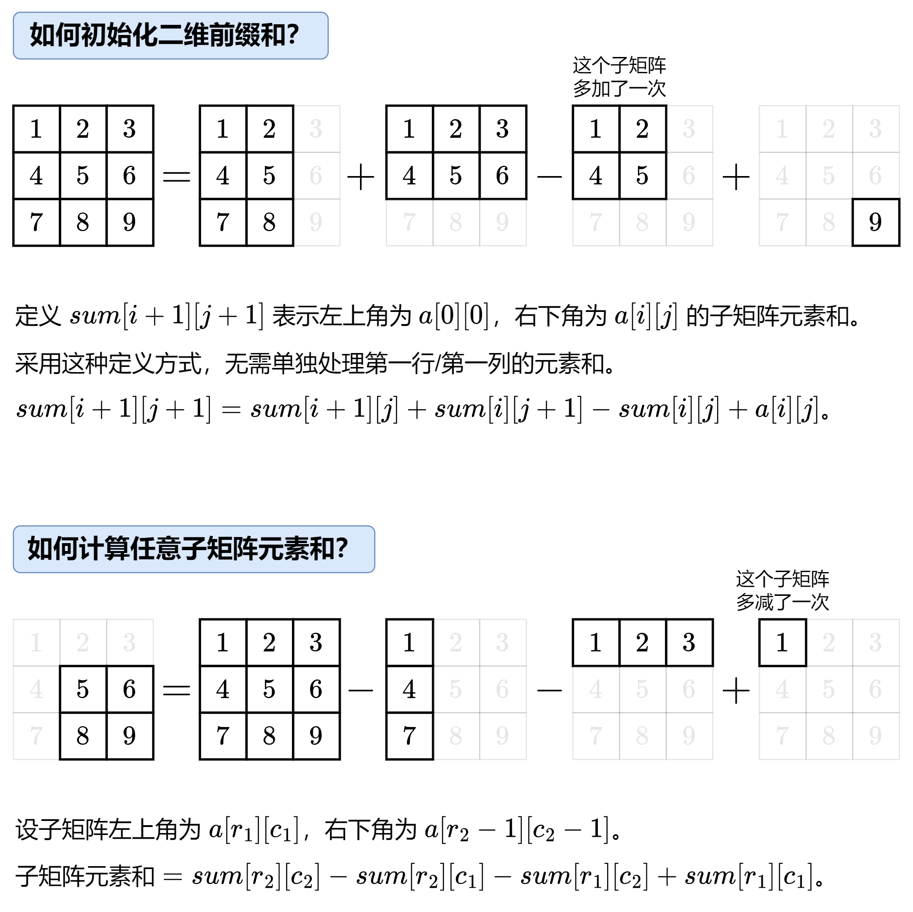

**请注意，对于Java语言而言，JVM在初始化`int`型数组时，每个元素会被默认的初始化为0，你无需手动再赋一遍值。而对JS或者C++而言，必须赋值为0才能保证数组初始化的正确。**

和一维的思想是很像的。
$sum[i][j] = 0 当 i = 0 或 j = 0$

直接上代码：
```java
class NumMatrix {
    private final int[][] sum;

    public NumMatrix(int[][] matrix) {
        int m = matrix.length;
        int n = matrix[0].length;
        sum = new int[m + 1][n + 1];
        for (int i = 0; i < m; i++) {
            for (int j = 0; j < n; j++) {
                sum[i + 1][j + 1] = sum[i + 1][j] + sum[i][j + 1] - sum[i][j] + matrix[i][j];
            }
        }
    }

    // 返回左上角在 (r1,c1) 右下角在 (r2,c2) 的子矩阵元素和
    public int sumRegion(int r1, int c1, int r2, int c2) {
        return sum[r2 + 1][c2 + 1] - sum[r2 + 1][c1] - sum[r1][c2 + 1] + sum[r1][c1];
    }
}
```

### 1.12.2 LeetCode 1292 元素和小于等于阈值的正方形的最大边长

这道题的思想也需要用到二维前缀和，只不过它多了个枚举的技巧。如何去优化，让算法时间复杂度降低呢？一是二分查找，二是直接从题目出发。20250606首刷，用的方法二，实在是太妙了。

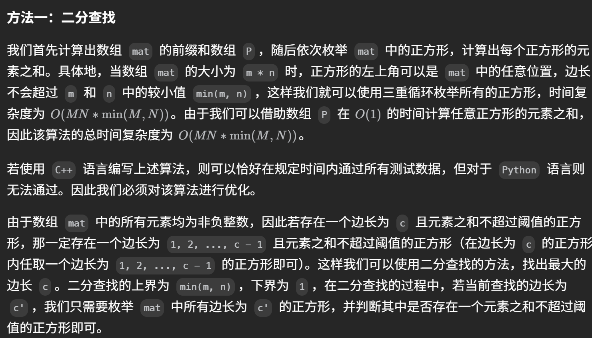
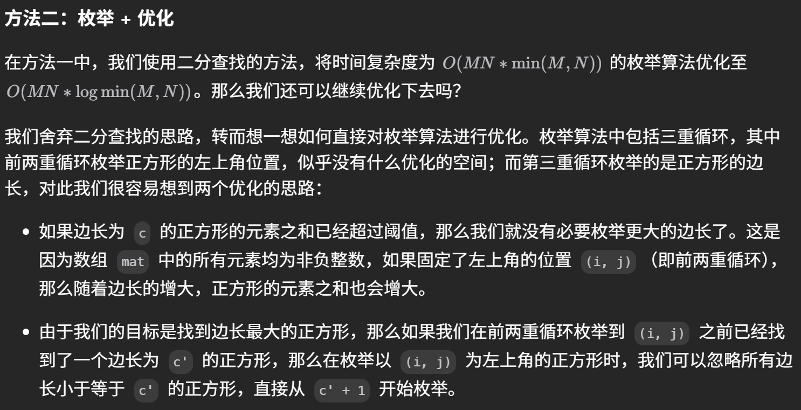

# 2. 链表

## 2.0 概述

链表的题大多与指针相关，这里需要记住，**在设置指针时一定要首先置空，避免出现野指针的情况。**

此外，在进行链表节点的更改时，同时也需要记得一次性修改好多节点，思维一定要清楚，需要及时进行验证（参考LeetCode 24的教训，想当然但是实际情况不是这样）。

**另外，什么时候需要添加哨兵节点呢，一般而言，如果我们需要对头节点进行改动，那么加上哨兵节点是为了找到链表的开始，如果不对头节点改动可以省略哨兵节点。** 如果想不明白，那么就默认都加哨兵节点就可以。

## 2.1 链表倒序

**本节基于LeetCode 92、206。**

针对链表倒序，使用迭代法。从头结点开始遍历，设置两个指针，curr和prev。curr指向当前节点，prev指向当前节点的前一个节点。每次迭代，将curr的next指向prev，然后prev和curr都向后移动一位。直到curr为空，prev就是新的头结点。同时，需要暂存curr的next节点，以免丢失。

还请记住一个性质。当遍历完链表，curr会指向null。而prev会指向最后一个节点。所以，prev就是新的头结点。

## 2.2 链表求交点 (Leetcode 161)

一般解法不难，这里如果想要使用时间复杂度为O(m+n)，空间复杂度为O(1)的办法，可以使用双指针法。两个指针分别指向两个链表的头结点，然后同时向后移动。当一个指针到达尾部时，将其指向另一个链表的头结点。这样，两个指针走过的路程是一样的。

这样子，如果他们真的有公共交点，假设链表a长度是m，链表b长度是n，公共部分长度为p，那么a指针走过的路程是m+(n-p)，b指针走过的路程是n+(m-p)，两个部分长度一样。所以，他们会在公共交点相遇。如果没有公共交点，他们会在null处相遇。

## 2.3 链表合并（LeetCode 23 21）

这两道题的启示是，在建立新链表的时候，需要创建一个**哨兵**节点，这个节点指向新链表的头结点。这样子，我们就可以在不知道新链表头结点的情况下，方便地返回新链表。

同时，链表的题目需要反复用到curr、prev等指针，循环条件往往是这些指针非空，在内存改接的时候需要经常注意是否访问到了不合法的内存，以免报错。

## 2.4 前后指针（LeetCode 19）

## 2.5 双向链表+哈希表 LeetCode 146 LRU缓存

这个题非常好。难度大，要在短时间内解出就必须多练。它同时是vue keep-alive组件中的核心算法。2024.7.31首刷。

## 2.6 前缀树 LeetCode 208

这个题采用前缀树思想，代码不好编，一定要上手操练。

# 3 树

写下这章时，本人已经好久没碰树了。树的题目一般都是通过递归，有的时候还会需要用到栈。必须掌握三种遍历方法。主要都是模板题。但下面的这些题还是很有意思的。

## 3.1 LeetCode 543 二叉树的直径

20240805首刷。直接写思路：从上往下遍历。当前结点的直径 = 左子树链长 + 右子树链长 + 2，当前节点链长 = max(左子树链长，右子树链长) + 1。

# 4 图

## 4.1 Vector存图

在C++语言中，图可以使用Vector进行存储。例如：

```cpp
vector<vector<int>> edges;
```

这实际上是一个邻接表，这样子，```edges[i]```就是一个```vector```，存储了```i```节点的所有邻接节点。

在Leetcode 207中，还用到了对于```vector```的```resize()```函数。通过该函数可以初始化（重置）邻接点的个数，方便图的建立。

## 4.2 LeetCode 207 课程表拓扑排序

# 5 二分查找 && 二叉查找树

## 5.1 二分查找

二分查找有模板和变式，此处以模板为例。模板如下：

这个模板是我高中时候学会的模板。什么都不用变。不用加一也不用减一。

```cpp
int binarySearch(vector<int>& nums, int target) {
    int left = 0, right = nums.size() - 1;
    while (left <= right) {
        int mid = (left + right) / 2;   // 中间值
        if (nums[mid] == target) return mid;
        else if (nums[mid] < target) left = mid + 1;    // 中间值+1
        else right = mid - 1;   // 中间值-1
    }
    return -1;
}
```

**至于变式，主要喜欢在left right还有mid上面做文章，喜欢+1-1，或者考你错误的二分解法，为什么不可以此类。**

### 5.1.1 LeetCode 34 题带来的启示

**二分查找，本质上需要牢记区间的定义！区间内的数（下标）都是还未确定与 target 的大小关系的，有的是 < target，有的是 ≥ target；区间外的数（下标）都是确定与 target 的大小关系的。**


一般来说，有上面图片中出现的四个问题：

- 返回有序数组中第一个 ≥ target 的下标。这是我们的板子，下面的题都可以转换成这个问题。
- 返回有序数组中第一个 > target 的下标。这就可以等价转换到第一个问题，**即返回第一个 ≥ (target + 1) 的下标**。
- 返回有序数组中最后一个 < target 的下标。也可以等价转换到第一个问题，**即返回第一个 ≥ target 的下标，这个下标再减1即为所求**。
- 返回有序数组中最后一个 ≤ target 的下标。可以先等价转换到第二个问题，**即返回第一个 > target 的下标，这个下标再减1即为所求**。接着把前半部分转换到第一个问题就是所求。

针对34题，给出了一个二分模板：

```javascript
let lowerBound = function (nums, target) {
    let n = nums.length;
    let a = 0;
    let b = n - 1;
    let mid = Math.floor((a + b) / 2);
    while (a <= b) {
        if (nums[mid] >= target) {
            b = mid - 1;
            mid = Math.floor((a + b) / 2);
        }
        else if (nums[mid] < target) {
            a = mid + 1;
            mid = Math.floor((a + b) / 2);
        }
    }
    return a;
}
```

怎么去想a和b什么时候直接等于mid，什么时候要+1 -1？就是看**区间的定义**。区间里面哪些数字是已经确定了大小，哪些数字还要再次确定大小。上面的板子是左闭右闭区间形式，还有左闭右开、全开区间等形式，只需要掌握一个就可以，空余时间可以多想想。

### 5.1.2 LeetCode 108

这个题可以直接使用二分查找的思想。mid作为根节点，然后左右分别递归建立树即可。感觉得把这题背下来。没遇到过可能想不出来。

### 5.1.3 LeetCode 2439 最小化数组中的最大值 二分答案

20250530已解决。一般而言，像这种**最小化最大/最大化最小**这种类型的题目，都能用二分答案来解决。这道题的难点在于怎么去想到这样的一个二分法则。参看灵神题解。

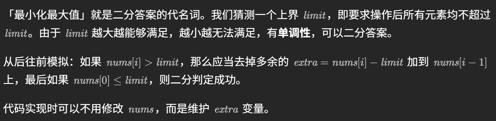

### 5.1.4 LeetCode 2517 礼盒的最大甜蜜度

20250531已解决。这道题的难点和2439题一样，在于如何写出`check`函数。


## 5.2 Leetcode 33 无序数组（旋转数组）二分查找

这道题是针对无序数组的二分查找。但实际上，二分查找的关键并不在于数组是否有序，**而是能否判断接下来的查找范围应该在数组的哪一边**。有序数组只是让这一步变得简单。

对于此题来说，也可以使用单次二分查找来解决。解题思路：按照二分模板算出mid，mid的左右两侧一定至少有一侧是有序的，如果target在有序的一侧，那么就在有序的一侧继续二分查找，否则在无序的一侧继续二分查找。

为什么可以这样做呢？**因为有序的一侧，我们可以直接判断target是否在这一侧，而无序的一侧，我们无法判断target是否在这一侧。** 所以，我们可以通过判断target是否在有序的一侧，来决定继续在哪一侧查找。

## 5.3 二叉查找树的恢复（Leetcode 449）

一个风和日丽的下午，还记得自己在学习数据结构的时候，听到ZJU何钦铭老师讲到如何恢复一棵二叉树。

**给定一棵二叉树，只要给出①先序遍历和中序遍历，或者②中序遍历和后续遍历，那么就一定能够恢复这棵二叉树。**

https://www.icourse163.org/learn/ZJU-93001?tid=1468825451#/learn/content?type=detail&id=1251326039&cid=1280334953

下面对①进行具体例子的分析：**先序遍历时，print的结果是根左右，中序遍历时，给的结果是左根右。** 那么，对于先序遍历和中序遍历，我们可以通过先序遍历找到根节点，然后在中序遍历中找到根节点的位置，这样子就可以确定左右子树的范围。然后，递归地构建左右子树。

**但是，这道题不能简单的用两种序列遍历方法恢复。此题的思路类似于LeetCode 297。**

## 5.4 Leetcode 315 树状数组

此题的另一种解法是归并排序。见**LCR 170**。

## 5.5 LeetCode 236 二叉树的最近公共祖先

这个题，递归+分类讨论，没有任何套路，直接贴解法。**非常好的典型题。用于深刻理解递归。**


```javascript
var lowestCommonAncestor = function(root, p, q) {
    if (root === null || root === p || root === q) {
        return root;
    }
    const left = lowestCommonAncestor(root.left, p, q);
    const right = lowestCommonAncestor(root.right, p, q);
    if (left && right) {
        return root;
    }
    return left ?? right;
};
```


## 平衡二叉树（AVL树）

关于AVL树，一颗树是平衡的话，我们需要能够手撕RR、LL、RL、LR四种旋转方式。

写代码的方式很简单。把每种情况模型抽象出来就行。

# 6 栈、队列、堆

## 6.1 Leetcode 224 计算器——栈的灵活运用

这道题肯定要用到栈。一个解法是，使用三参数。具体如下：

```cpp
int presign = 1;    // 初始时符号为1，表示正数
long long num = 0;    // 记录当前的数值
long long ans = 0;    // 存储答案
```

其中，`presign`表示当前的符号，`num`表示当前的数值，`ans`表示答案。下面详细介绍这三个参数的具体用法：

1. 初始时，`presign`需要设置成1，接下来每当读入＋时，`presign`设置成1，读入-时，`presign`设置成-1。这样子，`presign`就可以表示当前的符号。

2. 一个指针可以指到数字，那么每当读取一个数字，我就`num * 10 + s[k]`，其中`s[k]`代表当前读入的值。这是一种常用做法，`num`也就因此暂存遇到的数字。

3. 当遇到`+`或者`-`时，我们需要根据`presign`和`num`来更新`ans`。`ans += presign * num`。这样子，`ans`就可以存储当前的答案。

4. **当遇到左括号时，我们要将此时的`ans`和`presign`通通压入栈中，然后把`presign`复位，`num`和`ans`统统归0，相当于新开了一个函数，能够从0开始计算括号内的值。**

5. **当遇到右括号时，我们需要计算出来括号内的值了。算完之后，括号内的值整体应该当作一个数，重新传回暂存当前数的`num`之中，然后将`presign`和`ans`统统弹出来。**

如此反复循环，就完成了这道题的解。

### 6.1.1 LeetCode 227 772 计算器II 计算器III

这两道题是对这道计算器题的一个拓展，227不要求实现括号，但要求实现乘除运算；772则是要求又要实现括号，又要实现乘除运算。使用上面6.1的方法标记`presign`理论上亦可以实现，不过太繁琐。**在这里介绍RPE逆波兰式的方法，可以解决此类所有的计算器问题：**


先根据以上规则，将中缀表达式转化为后缀表达式，并将后缀表达式存入到一个数组`vec`中，在通过后缀表达式进行计算即可。如果搞不懂看视频：https://www.bilibili.com/video/BV1Nb4y1z7hG?spm_id_from=333.788.videopod.episodes&vd_source=3f8c5c4e56e5c611151b798b557016c9

## 6.2 Leetcode 215 数组中第K大的元素——堆的灵活运用

**注意：堆排很常见也很重要，务必掌握。** 本题采用建立大顶堆的方法。

## 6.3 Leetcode 295 数据流中的中位数

本题的核心思想也是用堆。这是一道Leetcode困难题，需要将时间复杂度降至`O(logn)`。注意以下两点结论：

1. 一个无序数组，建立堆的时间是`O(n)`，
2. **一个堆插入一个元素的时间是`O(logn)`，插入的方法是始终插入这棵完全二叉树最末尾的地方，然后反复调整。**
3. **一个堆删除一个元素的时间是`O(logn)`，始终删除堆顶，把堆的最末尾元素放到堆顶，然后反复调整。**

这里使用两个堆，一个大顶堆，一个小顶堆。大顶堆存储较小的一半，小顶堆存储较大的一半。这样子，中位数就可以通过两个堆的堆顶元素计算出来。下面是K神的代码：

```cpp
class MedianFinder {
public:
    priority_queue<int, vector<int>, greater<int>> A; // 小顶堆，保存较大的一半
    priority_queue<int, vector<int>, less<int>> B; // 大顶堆，保存较小的一半
    MedianFinder() { }
    void addNum(int num) {
        if (A.size() != B.size()) {
            A.push(num);
            B.push(A.top());
            A.pop();
        } else {
            B.push(num);
            A.push(B.top());
            B.pop();
        }
    }
    double findMedian() {
        return A.size() != B.size() ? A.top() : (A.top() + B.top()) / 2.0;
    }
};
```

**这段代码很巧妙。** 实际上，对于函数`addNum`，这里每次插入元素不用比较大小的原因在于，此时来了一个新的元素，我想插入A，他有两种情况，第一种他比B的堆顶元素大，此时理论上可以直接插入A；第二种情况，他比B的堆顶元素小，此时就不能直接插入A，需要先插入B维持较小的元素都在B内，然后取B的堆顶元素插入A； 而为了简化比较操作，回到第一种情况，可以先统一把元素插入B，然后此时B基于大顶堆的结构特性，会将该元素作为新的堆顶元素，此时再执行插入A的操作就相当于此前在B处过渡了一下，最终还是会插入A 可以理解是代码更简洁，但用堆的自身调整操作替换了比较大小的操作。

## 6.4 总结——堆

**通过 Leetcode 215 和 295，我们需要学会总结，一般而言，建立堆采用优先队列或者栈，虽然堆是一棵树，但是我们不能把它当成树来写。有的时候，数组也可以用来建堆。**

堆之所以叫优先队列，是因为可以像队列从 堆尾插入元素、堆顶删除元素，并且每次出队权值都是最大（大顶堆）/最小（小顶堆）元素。

### 建立堆

**我们必须搞清楚，我们可以在`O(n)`的时间内建立起一个堆，方法如下：（假设题目给我们了一个数组，使用数组建堆）**

1. 首先，我们可以把数组当成一个完全二叉树。
2. 然后从最后一个非叶子节点开始，依次向前调整，**采用“上溢”这种方法，注意，这种方法不可能需要“下溢”。** 使得每个节点都满足堆的性质。这样子，我们就可以在`O(n)`的时间内建立起一个堆。

### 堆排序

堆排序的思想是，我们先用`O(n)`时间或者`O(nlogn)`时间可以建立起一个堆，接着，我们每次删除堆顶元素，然后把堆的最末尾元素放到堆顶，然后调整堆（这样子从堆顶出来的数据一定有序），使得堆满足堆的性质，这又需要`O(nlogn)`的时间。这样子，我们就可以在`O(nlogn)`的时间内完成排序。

## 6.5 单调队列 

**单调队列套路：**

1. 入（元素进入**队尾**，同时维护队列**单调性**）
2. 出（元素离开**队首**）
3. 记录/维护答案（根据**队首**）

在C++语言下，我们使用`deque`来实现单调队列。`deque`是一个双端队列，可以在队首和队尾进行插入和删除操作。**需要注意的是，`deque`也可以支持随机访问，它是除了`vector` `string`外又一个可以使用`[]`访问的容器。**

`deque`的操作方法也很简单，加上队首只是相比于`vector`多了`pop_front()`和`push_front()`方法。

### 6.5.1 LeetCode 239 —— 滑动窗口最大值

这道题是一道经典的单调队列题。单调队列的特点是，队列中的元素是单调递增或者单调递减的。这样子，我们可以在O(1)的时间复杂度内找到队列中的最大值或者最小值。

这道题20240714首刷，20250407二刷，还是不会做，非常经典，三刷还是应该再做一做。

### 6.5.2 LeetCode 1438 绝对差不超过限制的最长连续子数组

这是上面第239题的变形，解法十分巧妙，20250408首刷，目前还没有合适的题解，直接看代码，二刷一定要做，非常精悍。

```javascript
/**
 * @param {number[]} nums
 * @param {number} limit
 * @return {number}
 */
var longestSubarray = function (nums, limit) {
    let qmax = [];  // 最大值队列
    let qmin = [];  // 最小值队列
    let ans = 0;
    let l = 0;
    for (let i = 0; i < nums.length; i++) {
        while (qmax.length !== 0 && nums[qmax[qmax.length - 1]] < nums[i]) {
            qmax.pop();
        }
        qmax.push(i);
        while (qmin.length !== 0 && nums[qmin[qmin.length - 1]] > nums[i]) {
            qmin.pop();
        }
        qmin.push(i);

        while (qmax.length !== 0 && qmin.length !== 0 && Math.abs(nums[qmax[0]] - nums[qmin[0]]) > limit) {
            if (nums[qmax[0]] === nums[l]) qmax.shift();
            if (nums[qmin[0]] === nums[l]) qmin.shift();
            l++;
        }

        ans = Math.max(ans, i - l + 1);
    }

    return ans;
};
```

### 6.5.3 LeetCode 862 和至少为K的最短子数组

这个题是前缀和+单调队列，可以理解解题思路，但是感觉自己想不出来。20250410首刷，仿佛已经达到思维上限。参看灵神题解。

### 6.5.4 LeetCode 1499 满足不等式的最大值

20250425首刷。这个题经过一个简单的变形可以变成单调队列，需要注意的是，计算最大值一定要在队尾出列之前，否则会遗漏。


## 6.6 单调栈

### 6.6.1 LeetCode 739 每日温度

单调栈的入门题。这个题和“接雨水”很类似。更好用单调栈的解法是，从右向左看`temperatures`，如果当前元素大于等于栈中元素，那么在前面的看到的一定是当前元素，因此直接把栈中元素弹掉。栈中存储的是元素的索引，这样通过计算两数之间的差值就是需要花的时间。

### 6.6.2 LeetCode 42 接雨水

这是力扣“臭名昭著”的题目，20240518首刷，20250331二刷。二刷时有思路且正确，但是没能实现代码。我觉得下次刷要是还解决不了，就看灵神视频或者我的一刷代码。

### 6.6.3 LeetCode 84 柱状图中最大的矩形

刷这个题前我刷了很多单调栈的题目，但都没有变形，非常简单。这个题有一些变形。单调栈只是这个题目中的一部分，最关键是要知道，面积最大的矩形的高度一定在`heights`数组中。有点像是思维题，20250404首刷，不保证二刷能做出，所以值得二刷。

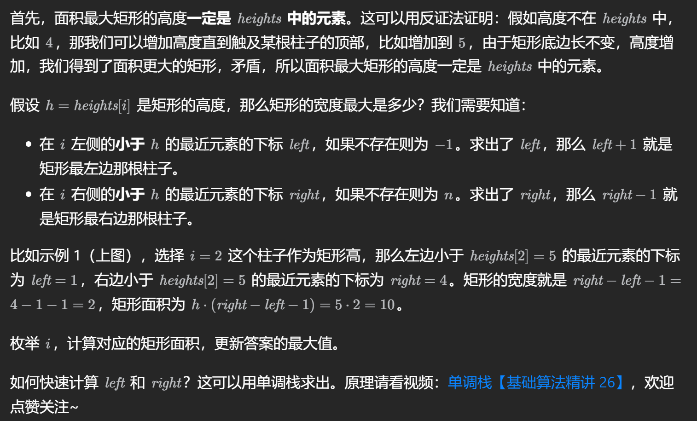

# 7 递归、回溯和分治

**从这一章开始我们跳出对基本数据结构的理解，开始走向算法设计。**

## 7.1 子集型回溯问题

本节基于LeetCode 78、17。

LeetCode 78 是我入手这一类问题的门。

下图是考虑子集型回溯问题的思路：


这是个思路一。事实上，还有思路二，按照灵神的说法就是站在答案的角度想问题。这种思路二的方法我还不会，有待补充。**思路一近似于动态规划的思想**。

模板见下：

```cpp
// LeetCode 78
class Solution {
public:
    int n;  
    vector<vector<int>> ans;    // 全局变量存答案

    vector<vector<int>> subsets(vector<int>& nums) {
        vector<int> path;
        n = nums.size();
        dfs(nums, path, 0);
        return ans;
    }

    void dfs(vector<int>& nums, vector<int>& path, int i){
        if(i == n){
            ans.push_back(path);
            return;
        } 
        // 不选这个，直接dfs下一个
        dfs(nums, path, i + 1);
        // 选这个，需要将这个加入path中，再dfs，最后再弹出
        path.push_back(nums[i]);
        dfs(nums, path, i + 1);
        path.pop_back();
    }
};
```

## 7.2 对称二叉树 LeetCode 101

这个题没啥好讲的，从上往下比较，比较左边节点和右边节点值是否相同后，在比较左边节点左儿子和右边节点右儿子是否相同以及左边节点右儿子和右边节点左儿子是否相同。但这个题的算法实在是太巧妙了，很难想到。

## 7.3 LeetCode 105 前序中序遍历构造树

也是递归。但是这题不好写。**可以动手多练。**

## 7.4 LeetCode 131 分割回文串

这个题，假设每对相邻字符之间有个逗号，那么就看每个逗号是选还是不选。通过这种方式完成回溯。这个题代码不容易写，建议多练。

# 8 贪心

**贪心，顾名思义，就是每一步都选择最优值。下面从几个例题中出发。**

## 8.1 LeetCode 376 摆动序列

**这个题略抽象。贪心的点在于，我们每一次都选择在`峰`或者在`谷`中的值。** 只需计算峰和谷的数量，我们就可以算出序列中存在多少个元素。

这个题贪心很复杂，我觉得不如动态规划。

## 8.2 LeetCode 402 移掉K位数字

**这个题目主要采用贪心+单调栈的思想。这个题目很经典，非常不错。**


# 9 技巧题

## 9.1 LeetCode 136 只出现一次的数字（位运算）

这个题使用位运算来实现。算法是，可以证明，我们只要把所有数字都亦或一遍（因为两个数相同亦或是0，一个数和0亦或是这个数本身），最后的结果就是只出现一次的数字。

## 9.2 LeetCode 189 轮转数组

这个题看起来也像技巧题。假设需要向右轮转$k$次，那么将数组向右轮转的办法是反转整个数组之后，先反转数组的前$k$位，后反转数组的后$n-k$位。

## 9.3 UVa 846 一维石子游戏

这个题是一道经典的技巧题。**这个题的解法是，我们可以通过数学归纳法证明，我们只需要找到一个数，使得这个数的平方小于等于$n$，这个数就是我们的答案。**


# 10 暴力与模拟

这部分类型的题，没有技巧可循，考验的就是纯代码能力。**注意，这种类型的题一定要想办法在紧张的环境下，限制自己的时间做题。** 这里推荐几个不错的题：

1. LeetCode 54 螺旋矩阵

2. LeetCode 240 搜索二维矩阵

3. LeetCode 3499 操作后最大活跃区段数I （不会直接看视频题解吧）

太妙了，实在是太妙了。从右上角开始搜索。

这种解法也同样适用于LeetCode 74。不过那个题简单。

# 11 排序

把排序题单独拎出来。这里主要是介绍归并排序与快速排序。

## 11.1 LeetCode 148 排序链表

这道题要求我们在链表上采用$O(nlog(n))$的时间复杂度来实现。显然我们得选择快速排序或者归并排序。这里我选择归并排序，参考K神的题解。**这种题一定要多动手实践**。

# 12 动态规划

## 12.1 LeetCode 5 最长回文子串 多维动态规划

针对这道题，我们定义`dp[i][j]`为“从i到j是否为回文子串”这一布尔类型。显然我们可以推导出这样的状态转移方程：dp[i][j] = dp[i + 1][j - 1] && (s[i] == s[j])。但显然这样子还不够。这些状态的初值如何确定呢？这里我们需要再添加一个判定条件：

```javascript
    if (j - i < 2) {
        if (s[i] === s[j]) dp[i][j] = true;    // 如果这个字符串只有两个字符比较这两个字符是否相同
    }
    else {
        dp[i][j] = dp[i + 1][j - 1] && (s[i] === s[j]);
    }
```

那如果只有一个字符呢？我们需要在开始时就将dp[i][i]类型的所有值都赋为true。

**而这个题最恶心的地方，就在于将状态转移方程应用的时候，需要一列一列从上往下遍历。至于这个结果怎么来的可以参看力扣官方题解。**

## 12.2 LeetCode 1143 最长公共子序列 LCS

**典中典，务必掌握。**

搞清楚下面的状态转移方程：


搞清楚简化版的状态转移方程，也就是可以优化的地方：


### 变式

**LeetCode 583** 两个字符串的删除操作，本质上就是1143，可以直接拿1143的代码写。**但是直接写对这个问题的动态规划代码更有助于锻炼思维。**

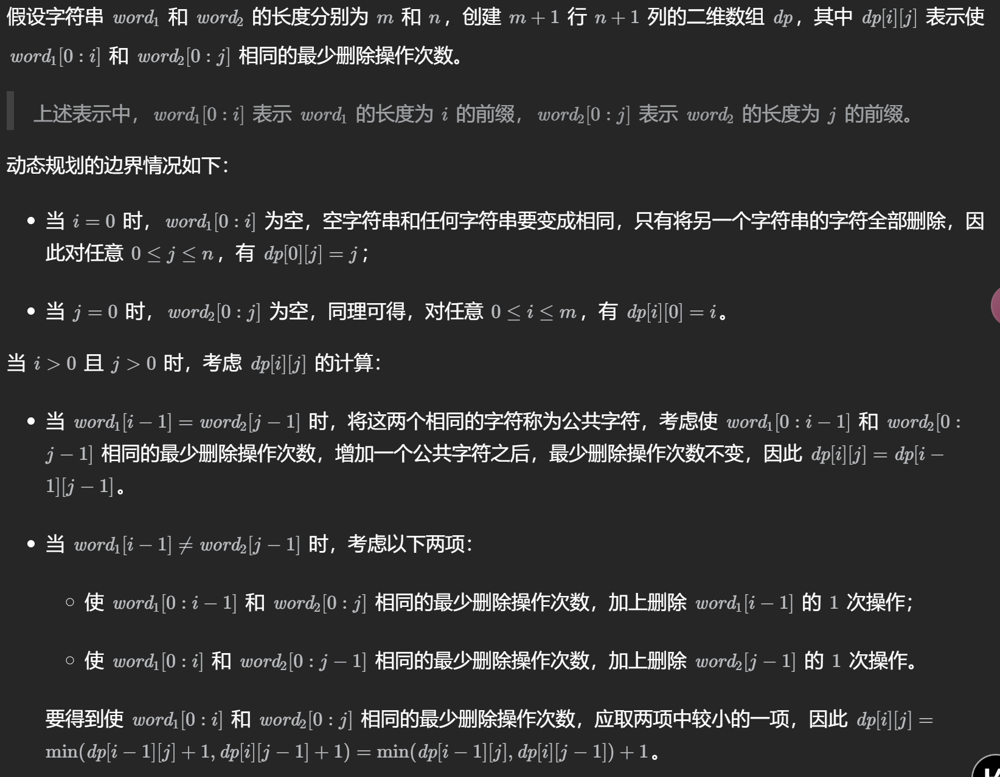

**LeetCode 97** 交错字符串。这个题我在一开始想的时候，想到了从后往前的动态规划，即：原问题，$s1[0:m]$ 和 $s2[0:n]$ 能否拼出交错的 $s3[0:k]$ ？如果 $s1[0] = s3[0]$，那么问题可以转化为由 $s1[1:m]$ 和 $s2[0:n]$ 能否拼出 $s3[1:k]$；如果 $s2[0] = s3[0]$，那么问题可以转化为由 $s1[0:m]$ 和 $s2[1:n]$ 能否拼出 $s3[1:k]$。我试图倒着来进行动态规划，但这样子很难实现。**实际上，这个思路同正解已经很近了，后来参考了官解，正着动态规划。** **2025新年第一刷，这个题可以反复练习。**

**LeetCode 115** 不同的子序列。非常好的困难题值得二刷，20250107首刷。还是看官方题解，题解的设dp数组的方式十分巧妙。


**LeetCode 1092** 最短公共超序列。20250115首刷。先求出LCS方案，接着使用双指针构造。我觉得这个题难在双指针部分，即如何在求出了LCS之后构造出最短公共超序列。好题，值得二刷。

## 12.3 LeetCode 300 最长上升子序列 LIS

**典中典，务必掌握。**


上面的普通动态规划方法时间复杂度是$O(n^2)$。**此外，还有一种使用贪心+二分的方法用于解决LIS类问题，可以将时间复杂度降到$O(nlogn)$，也需要掌握。** 下面介绍该方法：

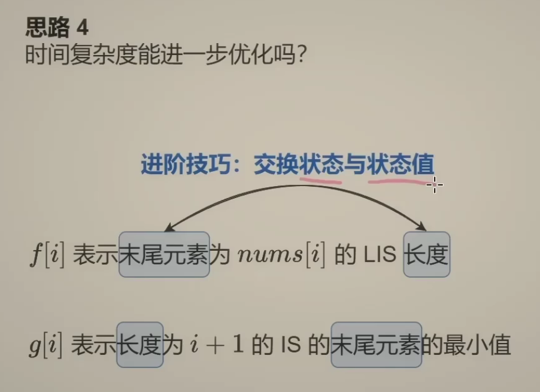

把状态与状态值进行交换。定义$g[i]$为长度为$i + 1$的上升子序列末尾元素最小值。这实际上是一种贪心的思想，我让末尾元素尽可能小，是为了让后面的元素有更大的机会加入到这个子序列中。详细的证明过程见灵神的视频题解。

维护一个序列$p$，二分查找第一个下标$j$，让$p[j]>=nums[i]$，如果不存在，则直接把$nums[i]$加入$p$的末尾，否则替换$p[j]$为$nums[i]$。这样子，当我遍历完整个序列时，$p$的长度就是最长上升子序列的长度。

### 12.3.1 673 最长递增子序列的个数

这个题是300的变形，20250122首刷，目前只掌握了普通动态规划的方法。具体思路参考官方题解。


### 12.3.2 354 俄罗斯套娃信封问题

这个题是在300题的基础上套了二维变形，20250125首刷。一开始我想的是对一维和二维都进行升序排序，但是实际上，**对第二个维度进行降序排序更能接近这题的本质。** 为什么呢？看下面：（下面的`h`就是第二个维度）


对第一和第二维排完序之后，只需要对第二维求LIS即可。

**这两个变形题也都出的非常经典，十分适合二刷。**

## 12.4 LeetCode 152 乘积最大子数组

这个题没啥好说的，关键难度在于状态转移方程的设计，2024.9.3是理解了，**改天再拿来做一遍**，如果做不出来就说明还没掌握。智商题。

## 12.5 LeetCode 72 编辑距离

这个题也是典中典，务必掌握。**这个题的状态转移方程是最难的。** 

整不明白看视频题解：https://leetcode.cn/problems/edit-distance/solutions/188223/bian-ji-ju-chi-by-leetcode-solution/

首先，我们要搞懂：**如果`word1[i] === word2[j]`，那么我们只需要比较word1[0...i-1]和word2[0...j-1]就可以了。** 这样子操作，也即是把两个word的最后一个字符给删去。

那如果`word1[i] !== word2[j]`呢？接下来，我们尝试理解编辑的含义。请注意，我们说的“编辑”操作都只针对`word1`而言。

大家不妨试着想一想，“插入”“删除”“替换”这些操作到底干了一件什么事？我们这样想，假设我把`word2[j]`放在了`word1[i]`的后面，即`word1[i+1]`的位置，那么，我是不是可以把这两个字符同时删去？这样子，我就可以把问题转化为比较`word1[0...i]`和`word2[0...j-1]`的问题。

同理，如果我把`word1[i]`删去，那么我是不是可以把问题转化为比较`word1[0...i-1]`和`word2[0...j]`的问题？如果我把`word1[i]`替换成`word2[j]`，那么我是不是可以把问题转化为比较`word1[0...i-1]`和`word2[0...j-1]`的问题？

**选择最小耗费的一步操作，随后我们需要将其得到的结果+1。我们用一个数组dp来存储耗费的步数。**

用两个图来搞清楚：

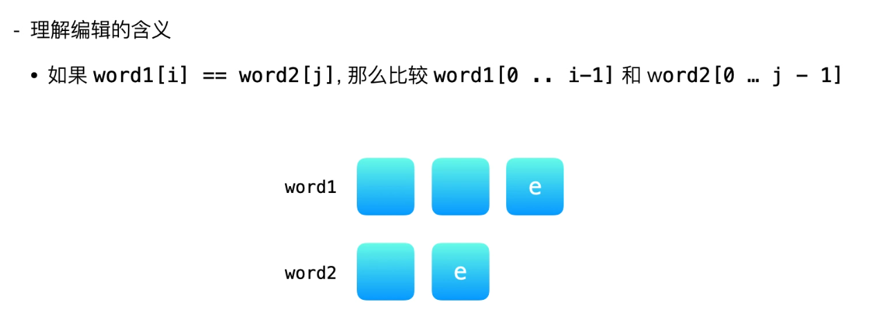

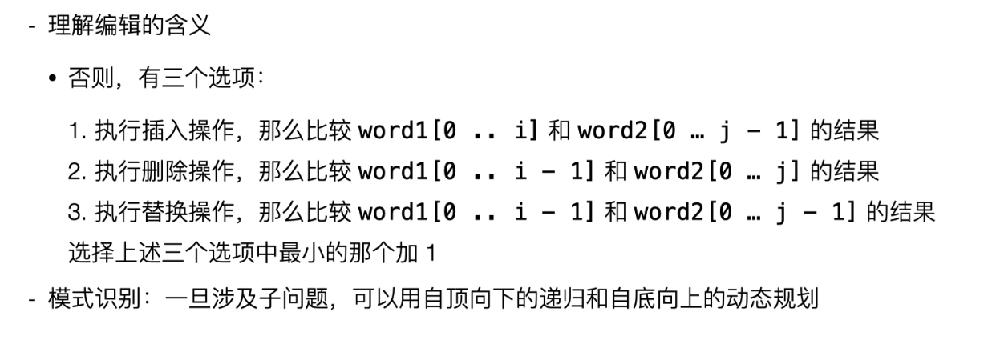

## 12.6 LeetCode 53 最大子数组和

不说了，直接上代码，20241006理解了，下次再拿出来刷：

```javascript
/**
 * @param {number[]} nums
 * @return {number}
 */
var maxSubArray = function (nums) {
    let n = nums.length;
    let dp = new Array(nums.length);
    dp[n - 1] = nums[n - 1];
    for (let i = n - 2; i >= 0; i--) {
        dp[i] = nums[i] + Math.max(0, dp[i + 1]);
    }
    let ans = dp[0];
    for (let i = 1; i < nums.length; i++) {
        if (dp[i] > ans) ans = dp[i];
    }
    return ans;
};
```

**这个题有个变形，是1749这个题，我在20241105拿出来做了，它只需要求两遍，一遍求最大值一遍求最小值即可，有点像脑筋急转弯问题。**

**这个题还有个变形，是991这个题。在20241108拿出来做了，也像是脑筋急转弯，只需要减掉中间的最小值，用同样的算法求出最小值即可。但这个题需要特别注意边界条件，相对1749上了难度。**

## 12.7 LeetCode 2266 统计打字方案数

这道题是爬楼梯+斐波那契额数列的进阶，关键在于理解两个状态转移方程：

$f[i] = (f[i - 1] + f[i - 2] + f[i - 3]) \% MOD$

$g[i] = (g[i - 1] + g[i - 2] + g[i - 3] + g[i - 4]) \% MOD$

两个状态转移方程如何理解？

当已知$dp[i-1]$的情况下，我们多加1个字符，如果 $chs[i] == chs[i-1]$ ，则加的那个字符可以作为一个单独字母跟之前的方案组成方案(方案数为$dp[i-1]$)，也可以与第$i-1$个字符组合变成另一个字母，然后与前面的字符组成新方案(方案数目为$dp[i-2]$)，但如果 $i-2<0$ ，则第$i$与$i-1$的字符组成的字母单独作为1个方案。

## 12.8 LeetCode 2435 矩阵中和能被K整除的路径

日期：20241205

这个题的技巧在于：把路径和模 $k$ 的结果当成一个扩展维度。具体地，定义 $f[i][j][v]$ 表示从左上走到 $(i,j)$，且路径和模 $k$ 的结果为 $v$ 时的路径数。

这个题让我知道了JS如何初始化三维数组，还是只能使用最笨的方法一维一维初始化。此外，为了防止某些状态转移方程下标越界，我们可以把每个下标都加上1。此外关于此题的初始化和状态转移方程也十分的巧妙。我在这里贴出完整代码。

这道题并不算太难，没有太大的数学思维量，却有着很巧妙的编程思维和动态规划思维。十分适合二刷。

```javascript
/**
 * @param {number[][]} grid
 * @param {number} k
 * @return {number}
 */
var numberOfPaths = function (grid, k) {
    const MOD = 10 ** 9 + 7;
    // 技巧：把路径和模 k 的结果当成一个扩展维度。
    // 初始化三维数组
    let m = grid.length;
    let n = grid[0].length;
    let arr = new Array(m + 1);
    for (let i = 0; i < m + 1; i++) {
        arr[i] = new Array(n + 1);
        for (let j = 0; j < n + 1; j++) {
            arr[i][j] = new Array(k).fill(0);
        }
    }
    arr[1][1][grid[0][0] % k] = 1;  // 初始化
    for (let i = 0; i < m; i++) {
        for (let j = 0; j < n; j++) {
            for (let v = 0; v < k; v++) {
                arr[i + 1][j + 1][(v + grid[i][j]) % k] = (arr[i + 1][j + 1][(v + grid[i][j]) % k] + arr[i][j + 1][v] + arr[i + 1][j][v]) % MOD;    // 刷表法
            }
        }
    }
    return arr[m][n][0];
};
```

## 12.9 LeetCode 494 目标和

20241207首刷。

这道题是背包问题的应用。众所周知，背包问题可以使用**回溯**法，但是对于很多竞赛题目来说，回溯的时间复杂度太高，会超时。虽然这道题不会超时，但是后面的很多问题都会超时。所以，我们需要把回溯改成动态规划。

**递归搜索 + 保存计算结果 = 记忆化搜索**

这道题参考灵神解法，我们可以把题目变成一个背包问题。接着，参照**选或不选**的思路，我们可以推出状态转移方程：

$dfs(i, c) = dfs(i - 1, c) + dfs(i - 1, c - nums[i])$

其中i为nums中的第i个元素，c为当前背包的和。

用一个dp数组记忆化存储，便加速了整个过程。**为了方便代码实现，我们把状态转移方程中的i加了1。** 完整代码参考力扣。

转移方程变成了$dfs(i + 1, c) = dfs(i, c) + dfs(i, c - nums[i])$。但这里我有个问题至始至终都不太清楚，那就是，**为什么后面的`nums[i]`不需要将i加1？**

接着，把思路变为递推。难点在于，怎样理解初始化？`dp[0][0] = 1;` 意思就是，当我们没有任何元素时，背包和为0的方案数为1。这个初始化是很巧妙的，需要多揣摩。

总的来说，这是一道十分经典的问题，是背包变形的基础，需要多多练习。

## 12.10 LeetCode 2218 从栈中取出K个硬币的最大面值和

20241227首刷。这道题通过前缀和转化为了一个背包问题，十分适合二刷。

## 12.11 状态机DP

这一类问题，代表题目为力扣上的**股票类问题**。所谓状态机DP，一般定义 $f[i][j]$ 表示前缀 $a[:i]$ 在状态 $j$ 下的最优值。一般 $j$ 都很小。

这一类题的解法我不喜欢灵神的解题思路，有点绕。个人推荐yyj的题解。整体思路如下：

```python
class Solution:
    def maxProfit(self, prices: List[int]) -> int:
        # 甲：这n天怎样买股票赚的多-------------------------------------
        n = len(prices)

        # 乙：dp[i]代表第i天-------------------------------------------
        # 乙：dp[i][0]代表第i天过后手上有股票时的最大收益
        # 乙：总之，今天过后我必有股票在手上，要么之前买的，要么今天买的
        # 乙：dp[i][1]代表第i天过后手上无股票时的最大收益
        # 乙：总之，今天过后我手上空空如也，要么本来就没有，有我也给卖了
        dp = [[0, 0] for _ in range(n)]

        # 乙： 今天是第一天---------------------------------------------
        # 乙： 保证必须有股票是吧，prices[0]块钱拿去，今天股票我买了
        # 乙： 保证没有股票，啥都不干就好了
        dp[0] = [-prices[0], 0]

        # 旁白： 时间一天天过去
        for i in range(1, n):
            # 甲： 今天是第i天，如果我一定要保证自己有股票，该怎么操作------
            # 乙： dp[i-1][0] 今天的股票太贵了，买之前的股票更划算
            # 乙： - prices[i] 今天的股票更便宜，我买了，prices[i]块钱拿去
            dp[i][0] = max(dp[i-1][0], - prices[i])

            # 甲： 今天是第i天，如果我一定要保证自己没有股票，该怎么操作------
            # 乙： dp[i-1][1] 今天股市不行，还是之前卖更划算
            # 乙： + prices[i] + dp[i-1][0] 今天的行情不错，股票卖掉，血赚prices[i]块钱，
            # dp[i-1][0]是我用低价买入花的钱
            dp[i][1] = max(dp[i-1][1], + prices[i] + dp[i-1][0])

        return dp[-1][-1]
```

### 12.11.1 LeetCode 2826 将三个数排序

这个题我们之前用了LIS的方法解决过，解决LIS问题的最快方法时间是$O(nlogn)$的，但是这个题有更简单的方法，就是状态机DP。20250208首刷。


### 12.11.2 LeetCode 1911 最大子序列交替和

20250208首刷。参考下面的思路：


总结来说，状态机DP就是一类股票问题，这类问题关键是怎么样合理定义状态，写出状态转移方程。

## 12.12 区间DP

一般的线性DP，我们是在数组的前缀或者后缀进行转移的。而这一类区间DP，我们会把问题的规模缩小到数组中间的区间上，不仅仅是前缀或者后缀了。

一般而言，我们定义$f[i][j]$为区间$[i,j]$的最优值。

区间DP有两个经典题，516和1039。1039太难了首刷还没做。

### 12.12.1 LeetCode 375 猜数字大小II

这个题没什么好说的，就是分区间，$O(n^3)$复杂度，也没法优化，20250222首刷，建议二刷。

### 12.12.2 LeetCode 132 分割回文串II

这个题连续套用两次DP，非常经典，20250225首刷。

一次就是初始化最小回文串，同力扣131。另一次还不能沿用上面那个猜数字大小的思想，而应该把状态定义为：$f[i]$表示前$i$个字符的最小分割次数。

**这道题给我的经验是如果一种定义方式行不通，不如考虑另外一种定义的方式，说不定会有惊喜之处。**

### 12.12.3 LeetCode 3040 相同分数的最大操作数II

这个题巧妙。20250226首刷。

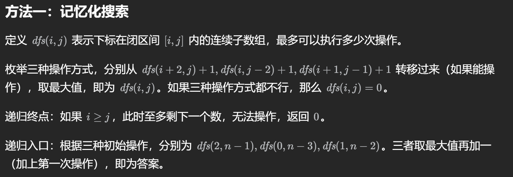

### 12.12.4 LeetCode 1312 让字符串成为回文串的最少插入次数

这又是一个回文题，我发现回文题总是会喜欢和区间DP结合在一起出题，20250309首刷。

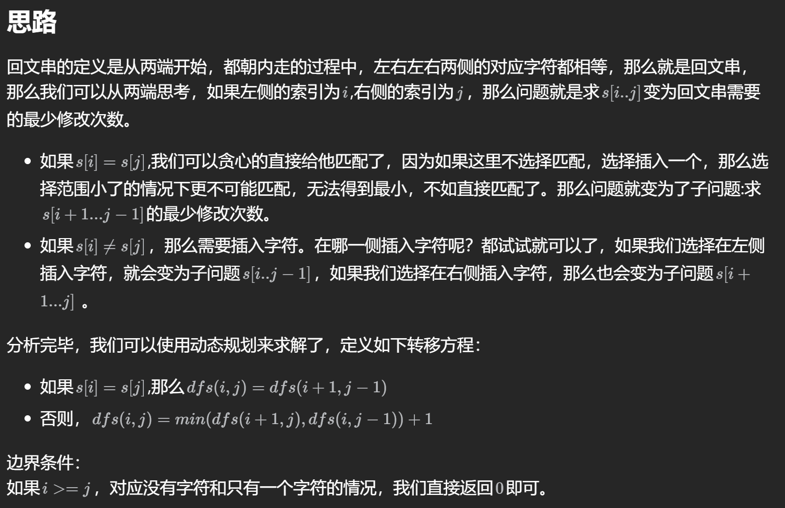

### 12.12.5 LeetCode 1770 执行乘法运算的最大分数

这个题非常好，20250310首刷。

这个题我起初用了$O(n^2)$的DP发现没做出来，内存超限了。一开始我定义状态的方式是$dp[i][j]$为存储采用题目这种方式计算的从`i`到`j`的最大分数。**但同样的思路对于Python3来说却没有任何问题，这就再一次说明了Python的@cache装饰器比普通定义状态的DP要来的灵活。**

接着我参考了题解，发现在其他语言上，用我一开始定义状态的方式是不可行的，我们需要转换对状态的定义。实际上，我们可以这样定义状态：$dp[p][q]$ 表示nums数组中前`p`个数和后`q`个数组成的最大分数。**接下来一步也很重要，这样子定义状态只能采用递推的方式，不能使用递归的方式了。**

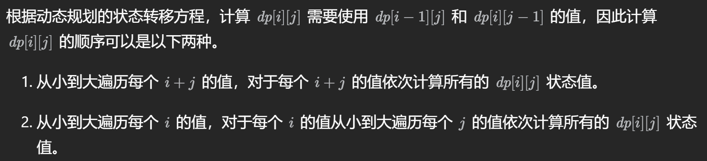

我个人倾向于采用第二种遍历方式。

### 12.12.6 LeetCode 1771 由子序列构造的最长回文串的长度

这个题我在20250311的时候思考了10分钟没想出来，就看题解了，其实很简单，把`word1+word2`看成是一个字符串`s`，那么这个题就很接近于516了，但是此题有两个陷阱：

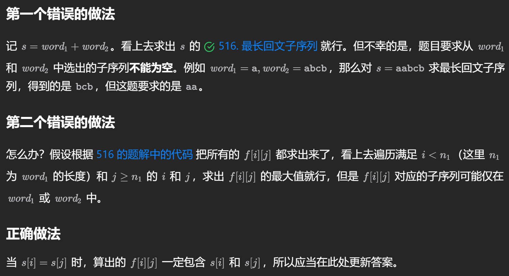

正确做法是什么意思呢，其实就是说，一旦我遇到了`s[i] === s[j]`的时候，我就要更新答案了，因为这个时候肯定是在`word1`和`word2`里都出现了字符。

### 12.12.7 LeetCode 1000 合并石头的最低成本

这个题使用了三维的区间DP，非常经典，值得二刷。20250313首刷。


到此为止，区间DP告一段落，我发现DP的题的难点在于，**如何定义状态**，这个问题很重要，很多时候我们定义的状态不对，就会导致无法解决问题。**区间DP的题很多道都没有自己做出来，整理的也比较多，因为区间DP上手就比较难。未来还得多多练习。**

## 12.13 树形DP①：树的直径

### 12.13.1 再提 LeetCode 543 二叉树的直径

这道题在本文第3.1节的时候提到过。

### 12.13.2 LeetCode 3203 合并两棵树之后的最小直径

20250320首刷。这个题非常好，非常值得二刷。

这个题有两个要点，第一个最重要的，是这个题的核心思想。我在一开始写题的时候也想到了应该取两棵树直径的中点连起来，但为什么是这样？随后我听了灵神的题解：

**如果属于下图中第三种情况，即新树的直径经过添加的边，那么，新直径在第一棵树的部分一定是由接入第一棵树的点引出，到第一棵树的最远点。如果接入这棵树的点不在直径上，那么它肯定还要走到直径上，接着实现它走最远的梦想。所以它在直径上。如果它在直径上，那么为了最小肯定得忘中点附近靠，否则就不平衡了，肯定大于中点的长度。**


第二个就是具体实现上。如果没告诉你一棵树具体长什么样，而是完全是通过像本文中用了一个edges给出的，**竟然可以直接把树变成邻接表的形式存储，并用邻接表去遍历这棵树！** 建立完邻接表之后，要像灵神写的代码一样，你是需要知道这个结点从哪里遍历过来，我不能倒着遍历回去，所以可以在`dfs`遍历函数里面再加一个根节点，告诉当前结点你的父亲是谁，具体参见下面的代码：

```java
// Java
private int dfs(int x, int fa, List<Integer>[] g) {
    int maxLen = 0;
    for (int y : g[x]) {
        if (y != fa) {
            int subLen = dfs(y, x, g) + 1;
            res = Math.max(res, maxLen + subLen);
            maxLen = Math.max(maxLen, subLen);
        }
    }
    return maxLen;
}
```

## 12.14 树形DP②：树上最大独立集

最大独立集是指，在一个图中选择尽量多的点，使得这些点互不相邻。由于树是特殊的图，因此在这里也成立。

那么一个变形就是下面的337题，**使最大化点权之和。**

### 12.14.1 LeetCode 337 打家劫舍III

这道题20250323首刷。一开始我想在一个dfs中直接调两个dfs，但很可惜超时了。原因是，一个调两次，那么两个调四次，$n$个就会调$2^n$次，超时是必然的。

而如果直接沿用打家劫舍I的思想，也行不通，因为在一棵树中，隔点访问必然涉及判断树是否为空的过程，代码写起来非常的复杂。

那么怎么办呢，方法是，可以一次性直接返回两个状态。由于代码很简洁，我直接在这里放代码：

```javascript
function dfs(node) {
    if (node === null) { // 递归边界
        return [0, 0]; // 没有节点，怎么选都是 0
    }
    const [lRob, lNotRob] = dfs(node.left); // 递归左子树
    const [rRob, rNotRob] = dfs(node.right); // 递归右子树
    const rob = lNotRob + rNotRob + node.val; // 选
    const notRob = Math.max(lRob, lNotRob) + Math.max(rRob, rNotRob); // 不选
    return [rob, notRob];
}

var rob = function(root) {
    return Math.max(...dfs(root)); // 根节点选或不选的最大值
};
```

### 12.14.2 LeetCode 2646 最小化旅行的价格总和

这题20250325首刷，和337异曲同工，没啥好说的，值得二刷。

## 12.15 树形DP③：树的最小支配集

### 12.15.1 LeetCode 968 监控二叉树

这个题20250327首刷。参看视频题解，定义状态的方式实在是太妙了。